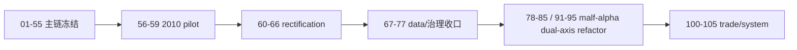

# 系统完成账本
`日期`：`2026-04-09`
`状态`：`持续更新`

1. 当前下一锤：`81-malf-origin-chat-semantic-truth-gap-freeze-card-20260419.md`
2. 当前待施工卡：`81-malf-origin-chat-semantic-truth-gap-freeze-card-20260419.md`
3. 正式主线剩余卡：`15`
4. 可选 Sidecar 剩余卡：`0`
5. 历史治理 backlog：`0`

## 已完成阶段

1. `01-55` 已完成治理基线、`data/malf/structure/filter/alpha/position/portfolio_plan` 主链第一轮冻结。
2. `56-59` 已完成 `2010` official middle-ledger pilot。
3. `60-66` 已完成 rectification、authority reset、wave life 与 formal signal admission 收口。
4. `67-77` 已完成 file-length、执行文档目录、objective gate、objective 历史回补、`market_base(backward)` 全历史修缮，以及 `raw/base day/week/month` 六库收口。

## 当前阶段

1. 最新生效结论锚点是 `91-malf-timeframe-native-base-source-rebind-conclusion-20260418.md`。
2. 当前正式主线待施工卡已切回 `81-malf-origin-chat-semantic-truth-gap-freeze-card-20260419.md`。
3. 当前 active 路径先处理 `81-85`，目标是先冻结 origin-chat 纯语义 `malf`、当前 canonical truth gap、`break / invalidation / confirmation` truth contract 与 stale guard 治理边界，再正式修改 canonical truth 并视需要重建三库；`91-95` 继续作为远置后的 downstream cutover 卡组保留。
4. 旧 official middle-ledger 恢复范围已删除，当前只保留 `78-85 / 91-95` 新路线。
5. `100-105` 仍需等待 `95` 放行。

## 体系图

