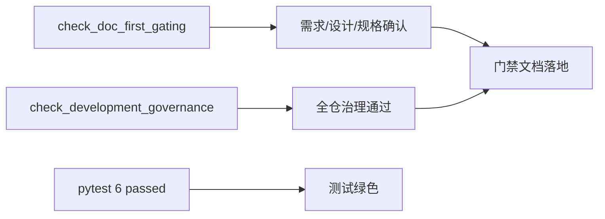

# 文档先行硬门禁检查器 证据

证据编号：`03`
日期：`2026-04-09`

## 命令

```text
.venv\Scripts\python.exe -m pytest tests\unit\system\test_doc_first_gating_governance.py -q
.venv\Scripts\python.exe -m pytest tests\unit\core\test_paths.py -q
.venv\Scripts\python.exe scripts\system\check_doc_first_gating_governance.py scripts/system/check_doc_first_gating_governance.py README.md AGENTS.md pyproject.toml
.venv\Scripts\python.exe scripts\system\check_development_governance.py
.venv\Scripts\python.exe scripts\system\check_development_governance.py AGENTS.md README.md pyproject.toml scripts/README.md scripts/system/check_development_governance.py scripts/system/check_entry_freshness_governance.py scripts/system/check_doc_first_gating_governance.py .codex/skills/lifespan-execution-discipline/SKILL.md docs/README.md docs/01-design/04-doc-first-gating-checker-charter-20260409.md docs/02-spec/04-doc-first-gating-checker-spec-20260409.md docs/03-execution/03-doc-first-gating-checker-card-20260409.md tests/unit/system/test_doc_first_gating_governance.py
.venv\Scripts\python.exe .codex/skills/lifespan-execution-discipline/scripts/check_execution_indexes.py --include-untracked
```

## 关键结果

- `tests/unit/system/test_doc_first_gating_governance.py` 通过，结果 `2 passed`。
- `tests/unit/core/test_paths.py` 通过，结果 `4 passed`。
- `check_doc_first_gating_governance.py` 在严格模式下通过，确认当前待施工卡已具备需求、设计、规格与任务分解。
- `check_development_governance.py` 在全仓扫描和按改动范围运行时都通过，其中入口新鲜度联动已要求同步刷新 `AGENTS.md`、`README.md`、`pyproject.toml`。
- `check_execution_indexes.py --include-untracked` 通过，说明执行索引、当前卡与完工账本保持一致。

## 产物

- `docs/01-design/04-doc-first-gating-checker-charter-20260409.md`
- `docs/02-spec/04-doc-first-gating-checker-spec-20260409.md`
- `scripts/system/check_doc_first_gating_governance.py`
- `tests/unit/system/test_doc_first_gating_governance.py`
- `scripts/system/check_development_governance.py`
- `scripts/system/check_entry_freshness_governance.py`

## 证据流图


