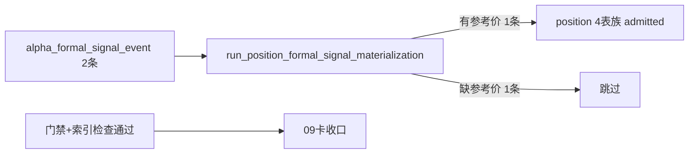

# position formal signal runner 与 bounded validation 证据

证据编号：`09`
日期：`2026-04-09`

## 命令

```text
python scripts/position/run_position_formal_signal_materialization.py --policy-id fixed_notional_full_exit_v1 --capital-base-value 1000000 --signal-start-date 2026-04-08 --signal-end-date 2026-04-08 --limit 10 --run-id position-runner-smoke-09 --summary-path H:\lifespan-0.01\scratch-09-work\runner-summary.json
python scripts/system/check_development_governance.py
python .codex/skills/lifespan-execution-discipline/scripts/check_execution_indexes.py --include-untracked
python scripts/system/check_doc_first_gating_governance.py
@'
from pathlib import Path
import sys
import duckdb

repo = Path(r'H:\lifespan-0.01')
sys.path.insert(0, str(repo / 'src'))

from mlq.core.paths import default_settings
from mlq.position import position_ledger_path, run_position_formal_signal_materialization
'@ | python -
```

## 关键结果

1. 正式脚本入口成功从 `alpha_formal_signal_event` bounded 读取 `2` 条样本，并只把存在参考价的 `1` 条样本落入 `position`：
   - `alpha_signal_count = 2`
   - `enriched_signal_count = 1`
   - `missing_reference_price_count = 1`
   - `position_run_id = position-runner-smoke-09`
2. bounded smoke 的正式落表摘要如下：
   - `position_candidate_audit = 1`
   - `position_capacity_snapshot = 1`
   - `position_sizing_snapshot = 1`
   - `position_funding_fixed_notional_snapshot = 1`
3. admitted 样本的关键落表事实为：
   - `candidate_nk = sig-101|fixed_notional_full_exit_v1|2026-04-09`
   - `candidate_status = admitted`
   - `final_allowed_position_weight = 0.1875`
   - `reference_trade_date = 2026-04-09`
   - `reference_price = 10.5`
   - `position_action_decision = open_up_to_context_cap`
   - `target_shares = 17800`
4. 兼容旧列名的 API smoke 成功读取旧口径 `alpha_formal_signal_event`：
   - `signal_id -> signal_nk`
   - `code -> instrument`
   - `pattern -> pattern_code`
   - `admission_status -> formal_signal_status`
   - `filter_trigger_admissible -> trigger_admissible`
   - `source_pas_signal_id -> source_trigger_event_nk`
   - `source_pas_contract_version -> signal_contract_version`
5. 旧口径兼容 smoke 成功把 `last_materialized_run_id` 透传为 `position_candidate_audit.source_signal_run_id`：
   - `signal_nk = sig-301`
   - `instrument = 000003.SZ`
   - `source_signal_run_id = alpha-run-legacy-001`
6. 本轮已新增单测文件 `tests/unit/position/test_runner.py`，但本机 `pytest` 在 `basetemp`/session cleanup 阶段持续触发 Windows 权限错误，导致无法把 runner 断言结果以 `pytest` 会话形式留证；因此本轮 runner 行为证据采用脚本 smoke 与直接 API smoke 双轨留证。

## 产物

1. `docs/02-spec/modules/position/03-position-formal-signal-runner-spec-20260409.md`
2. `src/mlq/position/runner.py`
3. `scripts/position/run_position_formal_signal_materialization.py`
4. `tests/unit/position/test_runner.py`
5. `docs/03-execution/09-position-formal-signal-runner-and-bounded-validation-card-20260409.md`

## 证据流图


