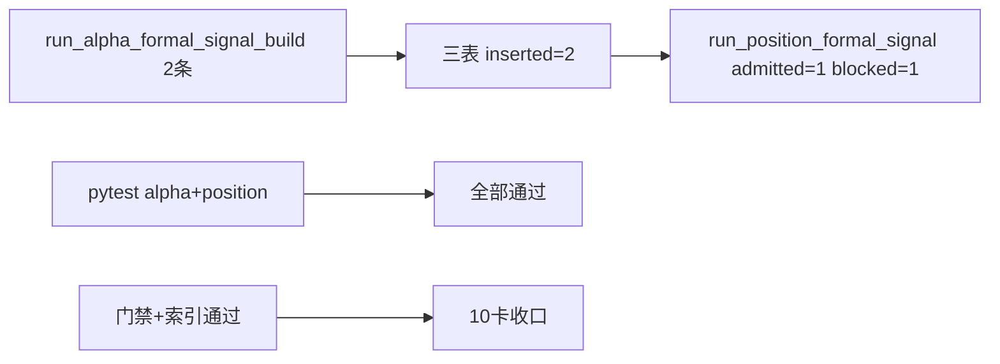

# alpha formal signal 正式出口合同与最小 producer 证据

证据编号：`10`
日期：`2026-04-09`

## 命令

```text
pytest tests/unit/alpha/test_runner.py -q
pytest tests/unit/position/test_runner.py -q

$env:PYTHONPATH='src'
$env:LIFESPAN_DATA_ROOT='H:\Lifespan-temp\alpha\smoke\10-alpha-formal-signal-producer\20260409\Lifespan-data'
$env:LIFESPAN_TEMP_ROOT='H:\Lifespan-temp\alpha\smoke\10-alpha-formal-signal-producer\20260409\Lifespan-temp'
$env:LIFESPAN_REPORT_ROOT='H:\Lifespan-temp\alpha\smoke\10-alpha-formal-signal-producer\20260409\Lifespan-report'
$env:LIFESPAN_VALIDATED_ROOT='H:\Lifespan-temp\alpha\smoke\10-alpha-formal-signal-producer\20260409\Lifespan-Validated'
python scripts/alpha/run_alpha_formal_signal_build.py --signal-start-date 2026-04-08 --signal-end-date 2026-04-08 --limit 10 --batch-size 1 --run-id alpha-formal-signal-smoke-001 --summary-path H:\Lifespan-temp\alpha\smoke\10-alpha-formal-signal-producer\20260409\alpha-summary.json
python scripts/position/run_position_formal_signal_materialization.py --policy-id fixed_notional_full_exit_v1 --capital-base-value 1000000 --signal-start-date 2026-04-08 --signal-end-date 2026-04-08 --limit 10 --run-id position-formal-signal-smoke-001 --summary-path H:\Lifespan-temp\alpha\smoke\10-alpha-formal-signal-producer\20260409\position-summary.json
python .codex/skills/lifespan-execution-discipline/scripts/check_execution_indexes.py --include-untracked
python scripts/system/check_doc_first_gating_governance.py
```

## 关键结果

- `pytest tests/unit/alpha/test_runner.py -q` 通过：覆盖三表落库、`inserted / reused / rematerialized`、以及 `alpha -> position` 真对接。
- `pytest tests/unit/position/test_runner.py -q` 通过：确认 `position` 仍按官方 `alpha_formal_signal_event` 合同稳定消费。
- bounded smoke 中，`scripts/alpha/run_alpha_formal_signal_build.py` 输出：
  - `run_id = alpha-formal-signal-smoke-001`
  - `candidate_trigger_count = 2`
  - `materialized_signal_count = 2`
  - `inserted_count = 2`
  - `admitted_count = 1`
  - `deferred_count = 1`
- bounded readout：
  - `alpha_formal_signal_run = [('alpha-formal-signal-smoke-001', 'completed', 2)]`
  - `alpha_formal_signal_event = [('000001.SZ', 'BOF', 'admitted', True, 'alpha-formal-signal-smoke-001'), ('000002.SZ', 'PB', 'deferred', False, 'alpha-formal-signal-smoke-001')]`
  - `alpha_formal_signal_run_event = [('alpha-formal-signal-smoke-001', 'inserted', 2)]`
- `scripts/position/run_position_formal_signal_materialization.py` 直接消费 smoke 产生的官方上游，输出：
  - `alpha_signal_count = 2`
  - `enriched_signal_count = 2`
  - `candidate_count = 2`
  - `admitted_count = 1`
  - `blocked_count = 1`
- `position_candidate_audit` readout：
  - `[('000001.SZ', 'admitted', 'alpha-formal-signal-smoke-001'), ('000002.SZ', 'deferred', 'alpha-formal-signal-smoke-001')]`
- `check_execution_indexes.py --include-untracked` 通过。
- `check_doc_first_gating_governance.py` 通过。

## 产物

- `src/mlq/alpha/bootstrap.py`
- `src/mlq/alpha/runner.py`
- `scripts/alpha/run_alpha_formal_signal_build.py`
- `tests/unit/alpha/test_runner.py`
- `docs/03-execution/10-alpha-formal-signal-contract-and-producer-conclusion-20260409.md`

## 证据流图


