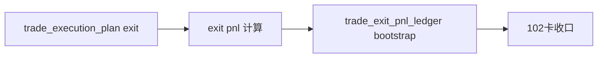

# trade exit pnl ledger bootstrap 证据

证据编号：`102`
日期：`2026-04-11`

## 命令

```text
<commands here>
```

## 关键结果

- 结果 1
- 结果 2

## 产物

- 产物路径 1
- 产物路径 2

## 证据流图


```mermaid
flowchart LR
    TRADE[trade_execution_plan exit] --> PNL[exit pnl 计算]
    PNL --> LEDGER[trade_exit_pnl_ledger bootstrap]
    LEDGER --> OK[102卡收口]
```
