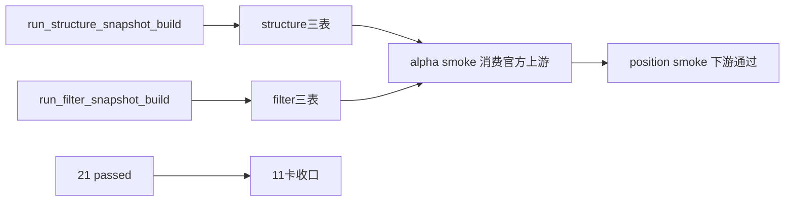

# structure/filter 正式分层与最小 snapshot 证据

证据编号：`11`
日期：`2026-04-09`

## 命令

```text
python -m compileall src scripts
pytest tests/unit
python scripts/structure/run_structure_snapshot_build.py --signal-start-date 2026-04-08 --signal-end-date 2026-04-08 --limit 10 --batch-size 10 --run-id structure-smoke-001 --summary-path H:\Lifespan-temp\structure\smoke\11-structure-filter\structure-summary.json
python scripts/filter/run_filter_snapshot_build.py --signal-start-date 2026-04-08 --signal-end-date 2026-04-08 --limit 10 --batch-size 10 --run-id filter-smoke-001 --summary-path H:\Lifespan-temp\filter\smoke\11-structure-filter\filter-summary.json
python scripts/alpha/run_alpha_formal_signal_build.py --signal-start-date 2026-04-08 --signal-end-date 2026-04-08 --limit 10 --batch-size 10 --run-id alpha-smoke-011 --summary-path H:\Lifespan-temp\alpha\smoke\11-structure-filter\alpha-summary.json
python scripts/position/run_position_formal_signal_materialization.py --policy-id fixed_notional_full_exit_v1 --capital-base-value 1000000 --signal-start-date 2026-04-08 --signal-end-date 2026-04-08 --limit 10 --run-id position-smoke-011 --summary-path H:\Lifespan-temp\position\smoke\11-structure-filter\position-summary.json
python .codex/skills/lifespan-execution-discipline/scripts/check_execution_indexes.py --include-untracked
python scripts/system/check_doc_first_gating_governance.py
```

## 关键结果

1. `pytest tests/unit` 全量通过，当前结果为 `21 passed`。
2. `structure` smoke 已能输出：
   - `structure_run / structure_snapshot / structure_run_snapshot`
   - `advancing / failed` 最小结构状态
3. `filter` smoke 已能输出：
   - `filter_run / filter_snapshot / filter_run_snapshot`
   - 最小硬门与保守放行 note
4. `alpha` smoke 已默认消费官方 `filter / structure snapshot` 上游，而不是旧 `malf` 兼容准入字段。
5. `position` smoke 继续可直接消费 `alpha_formal_signal_event`，说明本轮上游改造没有打断下游正式桥接。
6. `check_execution_indexes.py --include-untracked` 与 `check_doc_first_gating_governance.py` 通过后，11 号卡可按正式完成收口。

## 产物

- `src/mlq/structure/bootstrap.py`
- `src/mlq/structure/runner.py`
- `src/mlq/filter/bootstrap.py`
- `src/mlq/filter/runner.py`
- `scripts/structure/run_structure_snapshot_build.py`
- `scripts/filter/run_filter_snapshot_build.py`
- `tests/unit/structure/test_runner.py`
- `tests/unit/filter/test_runner.py`
- `docs/01-design/modules/structure/01-structure-formal-snapshot-charter-20260409.md`
- `docs/01-design/modules/filter/01-filter-formal-snapshot-charter-20260409.md`
- `docs/02-spec/modules/structure/01-structure-formal-snapshot-spec-20260409.md`
- `docs/02-spec/modules/filter/01-filter-formal-snapshot-spec-20260409.md`
- `docs/03-execution/11-structure-filter-formal-contract-and-minimal-snapshot-card-20260409.md`

## 证据流图


