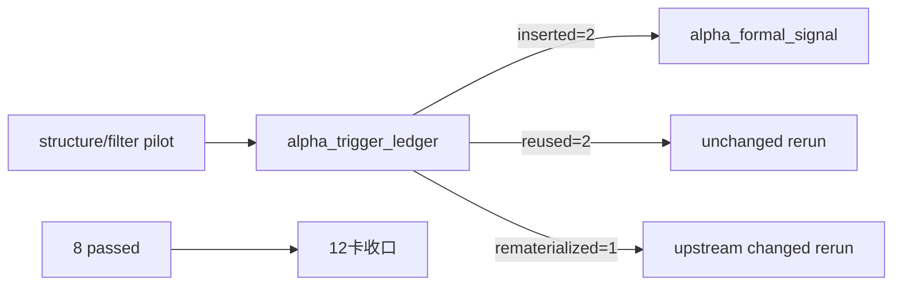

# alpha trigger ledger 与五表族最小物化证据

证据编号：`12`
日期：`2026-04-09`

## 命令

```text
$env:PYTHONPATH='src'
pytest tests/unit/alpha/test_runner.py tests/unit/position/test_runner.py -q
python -m compileall src/mlq/alpha scripts/alpha

$env:PYTHONPATH='src'; @'
... 在 H:\Lifespan-data\malf\malf.duckdb 写入 pas_context_snapshot / structure_candidate_snapshot 最小样本 ...
... 在 H:\Lifespan-data\alpha\alpha.duckdb 写入 alpha_trigger_candidate 最小样本 ...
'@ | python -

python scripts/structure/run_structure_snapshot_build.py --signal-start-date 2026-04-08 --signal-end-date 2026-04-08 --limit 10 --batch-size 10 --run-id structure-pilot-12-001 --summary-path H:\Lifespan-temp\structure\pilot\12-alpha-trigger-ledger\structure-summary-001.json
python scripts/filter/run_filter_snapshot_build.py --signal-start-date 2026-04-08 --signal-end-date 2026-04-08 --limit 10 --batch-size 10 --run-id filter-pilot-12-001 --summary-path H:\Lifespan-temp\filter\pilot\12-alpha-trigger-ledger\filter-summary-001.json
python scripts/alpha/run_alpha_trigger_ledger_build.py --signal-start-date 2026-04-08 --signal-end-date 2026-04-08 --limit 10 --batch-size 10 --run-id alpha-trigger-pilot-12-001 --summary-path H:\Lifespan-temp\alpha\pilot\12-alpha-trigger-ledger\trigger-summary-001.json
python scripts/alpha/run_alpha_formal_signal_build.py --signal-start-date 2026-04-08 --signal-end-date 2026-04-08 --limit 10 --batch-size 10 --run-id alpha-formal-signal-pilot-12-001 --summary-path H:\Lifespan-temp\alpha\pilot\12-alpha-trigger-ledger\formal-signal-summary-001.json

python scripts/alpha/run_alpha_trigger_ledger_build.py --signal-start-date 2026-04-08 --signal-end-date 2026-04-08 --limit 10 --batch-size 10 --run-id alpha-trigger-pilot-12-002 --summary-path H:\Lifespan-temp\alpha\pilot\12-alpha-trigger-ledger\trigger-summary-002.json

$env:PYTHONPATH='src'; @'
... 把 000001.SZ 的 structure_candidate_snapshot 改成 failed_extreme ...
'@ | python -

python scripts/structure/run_structure_snapshot_build.py --signal-start-date 2026-04-08 --signal-end-date 2026-04-08 --limit 10 --batch-size 10 --run-id structure-pilot-12-003 --summary-path H:\Lifespan-temp\structure\pilot\12-alpha-trigger-ledger\structure-summary-003.json
python scripts/filter/run_filter_snapshot_build.py --signal-start-date 2026-04-08 --signal-end-date 2026-04-08 --limit 10 --batch-size 10 --run-id filter-pilot-12-004 --summary-path H:\Lifespan-temp\filter\pilot\12-alpha-trigger-ledger\filter-summary-004.json
python scripts/alpha/run_alpha_trigger_ledger_build.py --signal-start-date 2026-04-08 --signal-end-date 2026-04-08 --limit 10 --batch-size 10 --run-id alpha-trigger-pilot-12-003 --summary-path H:\Lifespan-temp\alpha\pilot\12-alpha-trigger-ledger\trigger-summary-003.json
python scripts/alpha/run_alpha_formal_signal_build.py --signal-start-date 2026-04-08 --signal-end-date 2026-04-08 --limit 10 --batch-size 10 --run-id alpha-formal-signal-pilot-12-003 --summary-path H:\Lifespan-temp\alpha\pilot\12-alpha-trigger-ledger\formal-signal-summary-003.json

$env:PYTHONPATH='src'; @'
... readout alpha_trigger_run_event / alpha_trigger_event / alpha_formal_signal_event ...
'@ | python -
```

## 关键结果

- `pytest tests/unit/alpha/test_runner.py tests/unit/position/test_runner.py -q` 通过，结果为 `8 passed`。
- 正式 pilot 首轮真实写入 `H:\Lifespan-data`：
  - `structure-pilot-12-001` 写入 `2` 条 `structure_snapshot`
  - `filter-pilot-12-001` 写入 `2` 条 `filter_snapshot`
  - `alpha-trigger-pilot-12-001` 写入 `2` 条 `alpha_trigger_event`
  - `alpha-formal-signal-pilot-12-001` 写入 `2` 条 `alpha_formal_signal_event`
- unchanged rerun 证明 `reused` 成立：
  - `alpha-trigger-pilot-12-002` 输出 `inserted=0 / reused=2 / rematerialized=0`
- upstream changed rerun 证明 `rematerialized` 成立：
  - `structure-pilot-12-003` 输出 `reused=1 / rematerialized=1`
  - `filter-pilot-12-004` 输出 `reused=1 / rematerialized=1`
  - `alpha-trigger-pilot-12-003` 输出 `reused=1 / rematerialized=1`
- 正式库 readout 证明 trigger ledger 已成为 `formal signal` 的稳定官方上游：
  - `alpha_trigger_run_event = [('alpha-trigger-pilot-12-001', 'inserted', 2), ('alpha-trigger-pilot-12-002', 'reused', 2), ('alpha-trigger-pilot-12-003', 'rematerialized', 1), ('alpha-trigger-pilot-12-003', 'reused', 1)]`
  - `alpha_trigger_event` 中两条事实都带有 `source_filter_snapshot_nk / source_structure_snapshot_nk`
  - `alpha_formal_signal_event.source_trigger_event_nk` 已引用官方 `alpha_trigger_event.trigger_event_nk`
- 真实 pilot 还暴露出一个运行纪律：
  - `structure -> filter`
  - `alpha trigger ledger -> alpha formal signal`
 这两段都必须顺序执行，不应并行写共享下游库或共享上游快照。

## 产物

- `src/mlq/alpha/bootstrap.py`
- `src/mlq/alpha/trigger_runner.py`
- `src/mlq/alpha/__init__.py`
- `scripts/alpha/run_alpha_trigger_ledger_build.py`
- `tests/unit/alpha/test_runner.py`
- `AGENTS.md`
- `README.md`
- `scripts/README.md`
- `pyproject.toml`
- `H:\Lifespan-temp\alpha\pilot\12-alpha-trigger-ledger\trigger-summary-001.json`
- `H:\Lifespan-temp\alpha\pilot\12-alpha-trigger-ledger\trigger-summary-002.json`
- `H:\Lifespan-temp\alpha\pilot\12-alpha-trigger-ledger\trigger-summary-003.json`
- `H:\Lifespan-temp\alpha\pilot\12-alpha-trigger-ledger\formal-signal-summary-001.json`
- `H:\Lifespan-temp\alpha\pilot\12-alpha-trigger-ledger\formal-signal-summary-003.json`

## 证据流图


