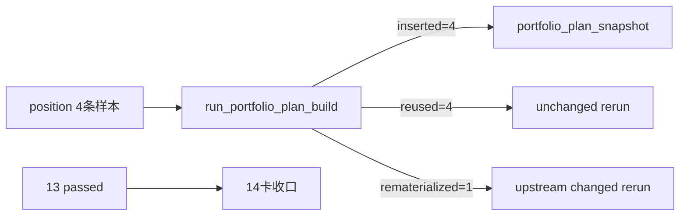

# portfolio_plan 最小账本与 position 桥接证据

证据编号：`14`
日期：`2026-04-09`

## 命令

```text
pytest tests/unit/position tests/unit/portfolio_plan -q

python -m pip install -e .
python -c "import mlq; print(mlq.__file__)"

python - <<'PY'
from mlq.core.paths import default_settings
from mlq.position import PositionFormalSignalInput, materialize_position_from_formal_signals

settings = default_settings(repo_root=r'H:\lifespan-0.01')
summary = materialize_position_from_formal_signals(
    [
        PositionFormalSignalInput(
            signal_nk='pilot-sig-001',
            instrument='000001.SZ',
            signal_date='2026-04-08',
            asof_date='2026-04-08',
            trigger_family='PAS',
            trigger_type='bof',
            pattern_code='BOF',
            formal_signal_status='admitted',
            trigger_admissible=True,
            malf_context_4='BULL_MAINSTREAM',
            lifecycle_rank_high=1,
            lifecycle_rank_total=4,
            source_trigger_event_nk='pilot-evt-001',
            signal_contract_version='alpha-formal-signal-v1',
            reference_trade_date='2026-04-09',
            reference_price=10.0,
            capital_base_value=1000000.0,
            remaining_single_name_capacity_weight=0.30,
            remaining_portfolio_capacity_weight=0.50,
            source_signal_run_id='alpha-pilot-run-001',
        ),
        PositionFormalSignalInput(
            signal_nk='pilot-sig-002',
            instrument='000002.SZ',
            signal_date='2026-04-08',
            asof_date='2026-04-08',
            trigger_family='PAS',
            trigger_type='pb',
            pattern_code='PB',
            formal_signal_status='admitted',
            trigger_admissible=True,
            malf_context_4='BULL_MAINSTREAM',
            lifecycle_rank_high=2,
            lifecycle_rank_total=4,
            source_trigger_event_nk='pilot-evt-002',
            signal_contract_version='alpha-formal-signal-v1',
            reference_trade_date='2026-04-09',
            reference_price=20.0,
            capital_base_value=1000000.0,
            remaining_single_name_capacity_weight=0.30,
            remaining_portfolio_capacity_weight=0.50,
            source_signal_run_id='alpha-pilot-run-001',
        ),
        PositionFormalSignalInput(
            signal_nk='pilot-sig-003',
            instrument='000003.SZ',
            signal_date='2026-04-08',
            asof_date='2026-04-08',
            trigger_family='PAS',
            trigger_type='tst',
            pattern_code='TST',
            formal_signal_status='blocked',
            trigger_admissible=False,
            malf_context_4='BEAR_MAINSTREAM',
            lifecycle_rank_high=0,
            lifecycle_rank_total=4,
            source_trigger_event_nk='pilot-evt-003',
            signal_contract_version='alpha-formal-signal-v1',
            reference_trade_date='2026-04-09',
            reference_price=8.0,
            capital_base_value=1000000.0,
            blocked_reason_code='alpha_not_admitted',
            source_signal_run_id='alpha-pilot-run-001',
        ),
        PositionFormalSignalInput(
            signal_nk='pilot-sig-004',
            instrument='000004.SZ',
            signal_date='2026-04-08',
            asof_date='2026-04-08',
            trigger_family='PAS',
            trigger_type='cpb',
            pattern_code='CPB',
            formal_signal_status='admitted',
            trigger_admissible=True,
            malf_context_4='BULL_COUNTERTREND',
            lifecycle_rank_high=2,
            lifecycle_rank_total=4,
            source_trigger_event_nk='pilot-evt-004',
            signal_contract_version='alpha-formal-signal-v1',
            reference_trade_date='2026-04-09',
            reference_price=16.0,
            capital_base_value=1000000.0,
            remaining_single_name_capacity_weight=0.30,
            remaining_portfolio_capacity_weight=0.50,
            source_signal_run_id='alpha-pilot-run-001',
        ),
    ],
    policy_id='fixed_notional_full_exit_v1',
    settings=settings,
    run_id='position-pilot-portfolio-plan-001',
)
print(summary)
PY

python scripts/portfolio_plan/run_portfolio_plan_build.py --portfolio-id main_book --portfolio-gross-cap-weight 0.25 --signal-start-date 2026-04-09 --signal-end-date 2026-04-09 --run-id portfolio-plan-pilot-20260409-001 --limit 10 --summary-path H:\Lifespan-report\portfolio_plan\portfolio-plan-pilot-20260409-001.json
python scripts/portfolio_plan/run_portfolio_plan_build.py --portfolio-id main_book --portfolio-gross-cap-weight 0.25 --signal-start-date 2026-04-09 --signal-end-date 2026-04-09 --run-id portfolio-plan-pilot-20260409-002 --limit 10

python - <<'PY'
import duckdb

conn = duckdb.connect(r'H:\Lifespan-data\position\position.duckdb')
try:
    candidate_nk = 'pilot-sig-002|fixed_notional_full_exit_v1|2026-04-09'
    conn.execute(
        '''
        UPDATE position_capacity_snapshot
        SET final_allowed_position_weight = 0.10
        WHERE candidate_nk = ?
        ''',
        [candidate_nk],
    )
    conn.execute(
        '''
        UPDATE position_sizing_snapshot
        SET final_allowed_position_weight = 0.10,
            target_weight = 0.10
        WHERE candidate_nk = ?
        ''',
        [candidate_nk],
    )
finally:
    conn.close()
PY

python scripts/portfolio_plan/run_portfolio_plan_build.py --portfolio-id main_book --portfolio-gross-cap-weight 0.25 --signal-start-date 2026-04-09 --signal-end-date 2026-04-09 --run-id portfolio-plan-pilot-20260409-003 --limit 10
python scripts/portfolio_plan/run_portfolio_plan_build.py --portfolio-id main_book --portfolio-gross-cap-weight 0.25 --signal-start-date 2026-04-09 --signal-end-date 2026-04-09 --run-id portfolio-plan-pilot-20260409-004 --limit 10

python - <<'PY'
import duckdb

conn = duckdb.connect(r'H:\Lifespan-data\portfolio_plan\portfolio_plan.duckdb', read_only=True)
try:
    print(
        conn.execute(
            '''
            SELECT run_id, admitted_count, blocked_count, trimmed_count
            FROM portfolio_plan_run
            ORDER BY started_at
            '''
        ).fetchall()
    )
    print(
        conn.execute(
            '''
            SELECT run_id, materialization_action, COUNT(*)
            FROM portfolio_plan_run_snapshot
            GROUP BY 1, 2
            ORDER BY 1, 2
            '''
        ).fetchall()
    )
    print(
        conn.execute(
            '''
            SELECT candidate_nk, plan_status, requested_weight, admitted_weight, trimmed_weight,
                   blocking_reason_code, portfolio_gross_remaining_weight, last_materialized_run_id
            FROM portfolio_plan_snapshot
            ORDER BY candidate_nk
            '''
        ).fetchall()
    )
finally:
    conn.close()
PY
```

## 关键结果

- `pytest tests/unit/position tests/unit/portfolio_plan -q` 通过，结果为 `13 passed`。
- `python -m pip install -e .` 后，裸 `python` 已稳定命中当前仓：`python -c "import mlq; print(mlq.__file__)"` 输出 `H:\lifespan-0.01\src\mlq\__init__.py`。
- 由于 `H:\Lifespan-data\position\position.duckdb` 在本轮开始前尚不存在，本轮先通过官方 `materialize_position_from_formal_signals(...)` 落下一组最小 `position` 样本，输出 `PositionMaterializationSummary(run_id='position-pilot-portfolio-plan-001', candidate_count=4, admitted_count=3, blocked_count=1, sizing_count=4, family_snapshot_count=4)`。
- `portfolio-plan-pilot-20260409-001` 首轮真实写入 `H:\Lifespan-data\portfolio_plan\portfolio_plan.duckdb`，输出：
  - `bounded_candidate_count=4`
  - `admitted_count=1 / blocked_count=2 / trimmed_count=1`
  - `inserted_count=4 / reused_count=0 / rematerialized_count=0`
- unchanged rerun 证明 `reused` 成立：
  - `portfolio-plan-pilot-20260409-002` 输出 `inserted_count=0 / reused_count=4 / rematerialized_count=0`
  - `portfolio-plan-pilot-20260409-004` 在裸 `python` 下复跑后仍输出 `inserted_count=0 / reused_count=4 / rematerialized_count=0`
- upstream changed rerun 证明 `rematerialized` 成立：
  - 受控修改 `position_capacity_snapshot / position_sizing_snapshot` 中 `pilot-sig-002|fixed_notional_full_exit_v1|2026-04-09` 的 `final_allowed_position_weight`
  - `portfolio-plan-pilot-20260409-003` 输出 `inserted_count=0 / reused_count=3 / rematerialized_count=1`
- 正式库 readout 证明组合层最小裁决账本已成立：
  - `portfolio_plan_run = [('portfolio-plan-pilot-20260409-001',1,2,1), ('portfolio-plan-pilot-20260409-002',1,2,1), ('portfolio-plan-pilot-20260409-003',1,2,1), ('portfolio-plan-pilot-20260409-004',1,2,1)]`
  - `portfolio_plan_run_snapshot = [('portfolio-plan-pilot-20260409-001','inserted',4), ('portfolio-plan-pilot-20260409-002','reused',4), ('portfolio-plan-pilot-20260409-003','rematerialized',1), ('portfolio-plan-pilot-20260409-003','reused',3), ('portfolio-plan-pilot-20260409-004','reused',4)]`
  - `portfolio_plan_snapshot` 当前稳定保留四条组合裁决事实，其中：
    - `pilot-sig-001...` 为 `admitted`
    - `pilot-sig-002...` 为 `trimmed`
    - `pilot-sig-003...` 为 `blocked`，`blocking_reason_code='position_candidate_blocked'`
    - `pilot-sig-004...` 为 `blocked`，`blocking_reason_code='portfolio_capacity_exhausted'`

## 产物

- `src/mlq/portfolio_plan/bootstrap.py`
- `src/mlq/portfolio_plan/runner.py`
- `src/mlq/portfolio_plan/__init__.py`
- `scripts/portfolio_plan/run_portfolio_plan_build.py`
- `tests/unit/portfolio_plan/test_bootstrap.py`
- `tests/unit/portfolio_plan/test_runner.py`
- `AGENTS.md`
- `README.md`
- `pyproject.toml`
- `H:\Lifespan-data\position\position.duckdb`
- `H:\Lifespan-data\portfolio_plan\portfolio_plan.duckdb`
- `H:\Lifespan-report\portfolio_plan\portfolio-plan-pilot-20260409-001.json`

## 证据流图


