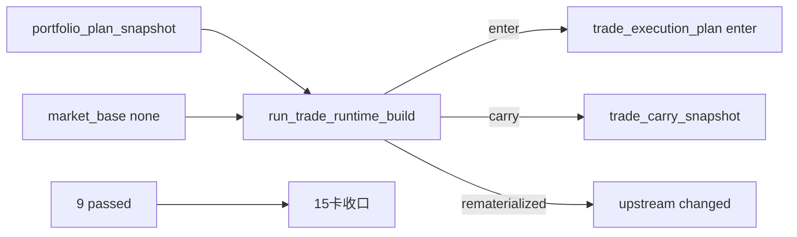

# trade 最小 runtime 账本与 portfolio_plan 桥接证据

日期：`2026-04-10`
对应卡片：`15-trade-minimal-runtime-ledger-and-portfolio-plan-bridge-card-20260409.md`
状态：`已收口`

## 治理入场

1. `python scripts/system/check_doc_first_gating_governance.py`
   - 结果：通过
   - 口径：当前待施工卡 `15-trade-minimal-runtime-ledger-and-portfolio-plan-bridge-card-20260409.md` 已具备需求、设计、规格与任务分解。

## 单元测试

1. `pytest tests/unit/trade -q`
   - 结果：`4 passed`
2. `pytest tests/unit/portfolio_plan tests/unit/trade -q`
   - 结果：`9 passed`

## 正式 bounded pilot 输入准备

1. 新建 `H:\Lifespan-data\base\market_base.duckdb`
   - 表：`stock_daily_adjusted`
   - 受控样本：
     - `000001.SZ`：`2026-04-10`、`2026-04-11`
     - `000002.SZ`：`2026-04-10`、`2026-04-11`
     - `000003.SZ`：`2026-04-10`
     - `000004.SZ`：`2026-04-10`
     - `000101.SZ`：`2026-04-10`
2. 在 `H:\Lifespan-data\portfolio_plan\portfolio_plan.duckdb` 增加独立受控组合：
   - `portfolio_id='trade_pilot_book'`
   - `plan_snapshot_nk='trade-pilot-001|trade_pilot_book|2026-04-09|portfolio-plan-v1'`
   - 首次权重：`requested_weight=admitted_weight=0.10`
3. rematerialized 验证前对同一 `trade_pilot_book` 行做受控更新：
   - `requested_weight=admitted_weight=0.15`
   - `last_materialized_run_id='trade-pilot-seed-002'`

## 正式 bounded pilot 命令

1. `python scripts/trade/run_trade_runtime_build.py --portfolio-id main_book --signal-start-date 2026-04-09 --signal-end-date 2026-04-09 --run-id trade-official-main-001 --summary-path H:\Lifespan-report\trade\card15\trade-official-main-001.json`
2. `python scripts/trade/run_trade_runtime_build.py --portfolio-id main_book --signal-start-date 2026-04-09 --signal-end-date 2026-04-09 --run-id trade-official-main-002 --summary-path H:\Lifespan-report\trade\card15\trade-official-main-002.json`
3. `python scripts/trade/run_trade_runtime_build.py --portfolio-id main_book --signal-start-date 2026-04-10 --signal-end-date 2026-04-10 --instrument 000001.SZ --run-id trade-official-main-carry-003 --summary-path H:\Lifespan-report\trade\card15\trade-official-main-carry-003.json`
4. `python scripts/trade/run_trade_runtime_build.py --portfolio-id trade_pilot_book --signal-start-date 2026-04-09 --signal-end-date 2026-04-09 --run-id trade-official-pilot-004a --summary-path H:\Lifespan-report\trade\card15\trade-official-pilot-004a.json`
5. `python scripts/trade/run_trade_runtime_build.py --portfolio-id trade_pilot_book --signal-start-date 2026-04-09 --signal-end-date 2026-04-09 --run-id trade-official-pilot-004b --summary-path H:\Lifespan-report\trade\card15\trade-official-pilot-004b.json`

## 正式 bounded pilot 结果

### `trade-official-main-001`

- `bounded_plan_count=4`
- `planned_entry_count=2`
- `blocked_upstream_count=2`
- `execution_plan_inserted_count=4`
- `position_leg_inserted_count=2`
- `carry_snapshot_inserted_count=4`

### `trade-official-main-002`

- `bounded_plan_count=4`
- `planned_entry_count=2`
- `blocked_upstream_count=2`
- `execution_plan_reused_count=4`
- `position_leg_reused_count=2`
- `carry_snapshot_reused_count=2`
- `carry_snapshot_rematerialized_count=2`

### `trade-official-main-carry-003`

- `bounded_plan_count=0`
- `planned_carry_count=2`
- `execution_plan_inserted_count=2`
- `position_leg_reused_count=2`
- `carry_snapshot_inserted_count=2`

### `trade-official-pilot-004a / 004b`

- `trade-official-pilot-004a`
  - `execution_plan_inserted_count=1`
  - `position_leg_inserted_count=1`
  - `carry_snapshot_inserted_count=1`
- `trade-official-pilot-004b`
  - `execution_plan_rematerialized_count=1`
  - `position_leg_rematerialized_count=1`
  - `carry_snapshot_rematerialized_count=1`

## 正式账本 readout

1. `trade_run`
   - `trade-official-main-001`：`(main_book, bounded_plan_count=4, planned_entry_count=2, blocked_upstream_count=2, carried_open_leg_count=2)`
   - `trade-official-main-002`：`(main_book, bounded_plan_count=4, planned_entry_count=2, blocked_upstream_count=2, carried_open_leg_count=2)`
   - `trade-official-main-carry-003`：`(main_book, bounded_plan_count=0, planned_entry_count=0, blocked_upstream_count=0, carried_open_leg_count=2)`
   - `trade-official-pilot-004a`：`(trade_pilot_book, bounded_plan_count=1, planned_entry_count=1, blocked_upstream_count=0, carried_open_leg_count=1)`
   - `trade-official-pilot-004b`：`(trade_pilot_book, bounded_plan_count=1, planned_entry_count=1, blocked_upstream_count=0, carried_open_leg_count=1)`
2. `trade_run_execution_plan`
   - `trade-official-main-001`：`planned_entry inserted x2`，`blocked_upstream inserted x2`
   - `trade-official-main-002`：`planned_entry reused x2`，`blocked_upstream reused x2`
   - `trade-official-main-carry-003`：`planned_carry inserted x2`
   - `trade-official-pilot-004a`：`planned_entry inserted x1`
   - `trade-official-pilot-004b`：`planned_entry rematerialized x1`
3. `trade_execution_plan`
   - `main_book`
     - `000001.SZ` / `000002.SZ`：`execution_action='enter'`，`execution_status='planned_entry'`，`planned_entry_trade_date='2026-04-10'`
     - `000003.SZ` / `000004.SZ`：`execution_action='block_upstream'`，`execution_status='blocked_upstream'`
     - carry run 为 `000001.SZ` / `000002.SZ` 额外生成 `execution_action='carry_forward'`，`execution_status='planned_carry'`
   - `trade_pilot_book`
     - `000101.SZ`：`planned_entry_weight` 已从 `0.10` rematerialize 到 `0.15`
4. `trade_carry_snapshot`
   - `main_book|000001.SZ|2026-04-09|trade-runtime-v1`：`current_position_weight=0.1875`，`open_leg_count=1`
   - `main_book|000002.SZ|2026-04-09|trade-runtime-v1`：`current_position_weight=0.0625`，`open_leg_count=1`
   - `main_book|000001.SZ|2026-04-10|trade-runtime-v1`：`retained_open_leg_ready`
   - `main_book|000002.SZ|2026-04-10|trade-runtime-v1`：`retained_open_leg_ready`
   - `trade_pilot_book|000101.SZ|2026-04-09|trade-runtime-v1`：最终 `current_position_weight=0.15`

## 产物位置

1. 正式账本：`H:\Lifespan-data\trade\trade_runtime.duckdb`
2. 正式行情最小样本：`H:\Lifespan-data\base\market_base.duckdb`
3. 正式组合受控样本：`H:\Lifespan-data\portfolio_plan\portfolio_plan.duckdb`
4. 运行摘要：
   - `H:\Lifespan-report\trade\card15\trade-official-main-001.json`
   - `H:\Lifespan-report\trade\card15\trade-official-main-002.json`
   - `H:\Lifespan-report\trade\card15\trade-official-main-carry-003.json`
   - `H:\Lifespan-report\trade\card15\trade-official-pilot-004a.json`
   - `H:\Lifespan-report\trade\card15\trade-official-pilot-004b.json`

## 证据流图

