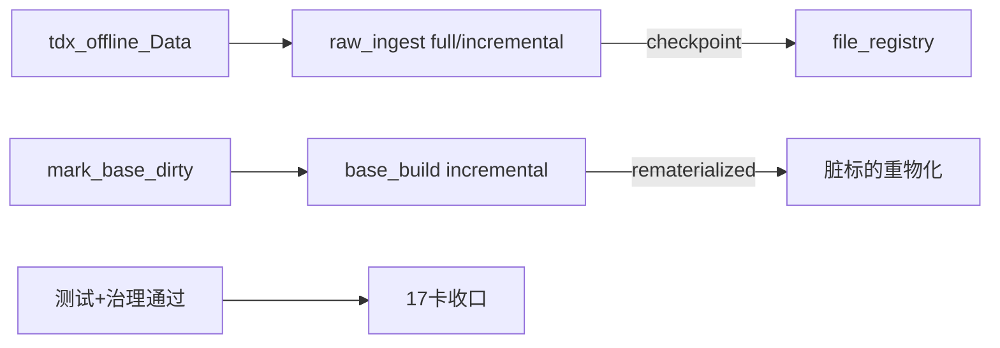

# raw/base 强断点与脏标的物化增强 证据

证据编号：`17`
日期：`2026-04-10`

## 命令

```text
python -m pytest tests/unit/data/test_data_runner.py --basetemp H:\Lifespan-temp\pytest\card17-slice5
python scripts/data/run_tdx_stock_raw_ingest.py --source-root H:\tdx_offline_Data --adjust-method backward --run-mode full --instrument 920000.BJ --instrument 920001.BJ --run-id raw-card17-official-001 --summary-path H:\Lifespan-report\data\card17\raw-official-full-001.json
python scripts/data/run_tdx_stock_raw_ingest.py --source-root H:\tdx_offline_Data --adjust-method backward --run-mode incremental --instrument 920000.BJ --instrument 920001.BJ --run-id raw-card17-official-002 --summary-path H:\Lifespan-report\data\card17\raw-official-incremental-002.json
python scripts/data/run_market_base_build.py --adjust-method backward --build-mode full --instrument 920000.BJ --instrument 920001.BJ --run-id base-card17-official-full-001 --summary-path H:\Lifespan-report\data\card17\base-official-full-001.json
python -c "from mlq.data import mark_base_instrument_dirty; mark_base_instrument_dirty(code='920000.BJ', adjust_method='backward', dirty_reason='card17_official_incremental_probe', source_run_id='base-card17-official-full-001')"
python scripts/data/run_market_base_build.py --adjust-method backward --build-mode incremental --instrument 920000.BJ --run-id base-card17-official-incremental-002 --summary-path H:\Lifespan-report\data\card17\base-official-incremental-002.json
python scripts/data/run_tdx_stock_raw_ingest.py --source-root H:\Lifespan-temp\card17-controlled\source --adjust-method backward --run-mode full --instrument 920000.BJ --instrument 920001.BJ --run-id raw-card17-controlled-001 --summary-path H:\Lifespan-report\data\card17\raw-controlled-full-001.json
python scripts/data/run_tdx_stock_raw_ingest.py --source-root H:\Lifespan-temp\card17-controlled\source --adjust-method backward --run-mode incremental --force-hash --instrument 920000.BJ --instrument 920001.BJ --run-id raw-card17-controlled-002 --summary-path H:\Lifespan-report\data\card17\raw-controlled-forcehash-002.json
python scripts/data/run_tdx_stock_raw_ingest.py --source-root H:\Lifespan-temp\card17-controlled\source --adjust-method backward --run-mode incremental --continue-from-last-run --instrument 920000.BJ --instrument 920001.BJ --run-id raw-card17-controlled-003 --summary-path H:\Lifespan-report\data\card17\raw-controlled-continue-003.json
python .codex/skills/lifespan-execution-discipline/scripts/check_execution_indexes.py --include-untracked
python scripts/system/check_doc_first_gating_governance.py
```

## 关键结果

- `tests/unit/data/test_data_runner.py` 共 `6` 个用例全部通过。
- `raw` 侧新增断言已覆盖：
  - `raw_ingest_run` 的 `running -> completed / failed` 落账
  - `raw_ingest_file` 的 `inserted / skipped_unchanged / rematerialized / failed` 动作记录
  - 失败文件在 rollback 后仍留下 run/file 审计信息
- `raw` 侧新增断言已进一步覆盖：
  - `force_hash=True` 时对“size/mtime 未变但内容已变”的文件进行强校验
  - `continue_from_last_run=True` 时从最近一次失败 run 中跳过已完成文件，只续跑剩余文件
  - raw 成功 ingest 后自动写入 `base_dirty_instrument`
- `base` 侧新增断言已覆盖：
  - `full` 模式成功后会清理本轮覆盖范围内的 pending dirty
  - bootstrap 会清理历史重复/脏行，并补齐唯一约束
- official bounded pilot 已在 `H:\tdx_offline_Data -> H:\Lifespan-data` 上完成：
  - `raw-card17-official-001` 证明 `raw full` 在正式库上可完成文件级审计
  - `raw-card17-official-002` 证明 `raw incremental` 在正式库上可稳定复跑
  - `base-card17-official-full-001` 证明 `base full` 在正式库上可稳定复跑
  - `base-card17-official-incremental-002` 证明 `base incremental` 能消费 dirty queue 并留下 run/action 审计
- controlled bounded replay 已在 `H:\Lifespan-temp\card17-controlled` 上完成：
  - `raw-card17-controlled-002` 证明 `force_hash` 能识别 size/mtime 未变但内容变更的文件，并把 run 记为 `failed`
  - `raw-card17-controlled-003` 证明 `continue_from_last_run` 会只续跑最近失败 run 中未完成的文件
- 收口后治理校验已通过：
  - `check_execution_indexes.py --include-untracked` 通过，执行索引与新增结论目录同步
  - `check_doc_first_gating_governance.py` 通过，卡 `17` 的文档前置与执行闭环未被破坏

## 产物

- `src/mlq/data/bootstrap.py`
- `src/mlq/data/runner.py`
- `scripts/data/run_tdx_stock_raw_ingest.py`
- `scripts/data/run_market_base_build.py`
- `tests/unit/data/test_data_runner.py`
- `H:\Lifespan-report\data\card17\raw-official-full-001.json`
- `H:\Lifespan-report\data\card17\raw-official-incremental-002.json`
- `H:\Lifespan-report\data\card17\base-official-full-001.json`
- `H:\Lifespan-report\data\card17\base-official-incremental-002.json`
- `H:\Lifespan-report\data\card17\official-readout-001.json`
- `H:\Lifespan-report\data\card17\raw-controlled-full-001.json`
- `H:\Lifespan-report\data\card17\raw-controlled-continue-003.json`
- `H:\Lifespan-report\data\card17\controlled-readout-001.json`

## 证据流图


