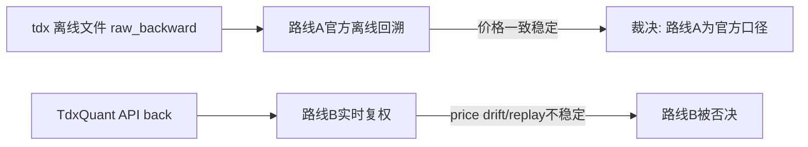

# raw/base 每日复权增量更新方案选型 证据

证据编号：`18`
日期：`2026-04-10`

## 命令

```text
Get-Process | Where-Object { $_.ProcessName -match 'tdx|Tdx|TQ|Tong' } | Select-Object ProcessName,Id,MainWindowTitle,Path

python - <<'PY'
import struct
from pathlib import Path
from datetime import datetime
samples = [
    (r'H:\new_tdx64\vipdoc\sz\lday\sz000001.day', '000001.SZ'),
    (r'H:\new_tdx64\vipdoc\sh\lday\sh510300.day', '510300.SH'),
    (r'H:\new_tdx64\vipdoc\bj\lday\bj920021.day', '920021.BJ'),
    (r'H:\new_tdx64\vipdoc\bj\lday\bj430017.day', '430017.BJ'),
]
for file_path, code in samples:
    path = Path(file_path)
    print({'code': code, 'exists': path.exists(), 'mtime': path.stat().st_mtime if path.exists() else None})
    if not path.exists():
        continue
    rows = []
    with path.open('rb') as f:
        while True:
            chunk = f.read(32)
            if not chunk:
                break
            date, open_, high, low, close, amount, volume, _ = struct.unpack('<lllllfll', chunk)
            rows.append((datetime.strptime(str(date), '%Y%m%d').date().isoformat(), open_ / 100.0, high / 100.0, low / 100.0, close / 100.0, volume, float(amount)))
    print({'code': code, 'rows': len(rows), 'first': rows[0], 'last': rows[-1], 'tail': rows[-3:]})
PY

python - <<'PY'
import sys
sys.path.insert(0, r'H:\new_tdx64\PYPlugins\user')
from tqcenter import tq
init_path = r'G:\new_tdx64\PYPlugins\user\card18_probe_price_modes_001.py'
codes = ['000001.SZ', '510300.SH', '920021.BJ']
try:
    tq.initialize(init_path)
    for code in codes:
        print({'code': code})
        for mode in ['none', 'front', 'back']:
            data = tq.get_market_data(stock_list=[code], period='1d', count=5, dividend_type=mode)
            close_df = data.get('Close')
            factor_df = data.get('ForwardFactor')
            print({
                'mode': mode,
                'keys': list(data.keys()),
                'close_tail': close_df.tail(5).reset_index().to_dict(orient='records'),
                'factor_tail': factor_df.tail(5).reset_index().to_dict(orient='records'),
            })
finally:
    try:
        tq.close()
    except Exception:
        pass
PY

python - <<'PY'
import sys
sys.path.insert(0, r'H:\new_tdx64\PYPlugins\user')
from tqcenter import tq
init_path = r'G:\new_tdx64\PYPlugins\user\card18_probe_meta_002.py'
try:
    tq.initialize(init_path)
    for code in ['000001.SZ', '510300.SH', '920021.BJ']:
        info = tq.get_stock_info(code)
        print({'code': code, 'keys': list(info.keys())[:20], 'sample': {k: info[k] for k in list(info.keys())[:8]}})
finally:
    try:
        tq.close()
    except Exception:
        pass
PY

python - <<'PY'
import sys
sys.path.insert(0, r'H:\new_tdx64\PYPlugins\user')
from tqcenter import tq
init_path = r'G:\new_tdx64\PYPlugins\user\card18_probe_lists_003.py'
try:
    tq.initialize(init_path)
    for market in ['0', '1', '2', '5']:
        value = tq.get_stock_list(market=market)
        print({'market': market, 'len': len(value), 'preview': value[:10]})
finally:
    try:
        tq.close()
    except Exception:
        pass
PY

python - <<'PY'
from pathlib import Path
path = Path(r'H:\new_tdx64\PYPlugins\user\tqcenter.py')
text = path.read_text(encoding='utf-8', errors='ignore').splitlines()
for start, end in [(410, 505), (872, 955), (1278, 1307), (2219, 2248)]:
    for lineno in range(start, end + 1):
        print(f'{lineno:04d}: {text[lineno - 1]}')
PY

python - <<'PY'
import duckdb
from pathlib import Path
raw = Path(r'H:\Lifespan-data\raw\raw_market.duckdb')
base = Path(r'H:\Lifespan-data\base\market_base.duckdb')
queries = [
    ('000001.SZ', ['2026-04-03', '2026-04-07', '2026-04-08', '2026-04-09', '2026-04-10']),
    ('920021.BJ', ['2025-09-30', '2026-04-07', '2026-04-08', '2026-04-09', '2026-04-10']),
    ('510300.SH', ['2026-04-03', '2026-04-07', '2026-04-08', '2026-04-09', '2026-04-10']),
]
with duckdb.connect(str(raw), read_only=True) as raw_conn, duckdb.connect(str(base), read_only=True) as base_conn:
    print({'base_adjust_method_counts': base_conn.execute("select adjust_method, count(*) from stock_daily_adjusted group by 1 order by 1").fetchall()})
    for code, dates in queries:
        dates_sql = ','.join([f"DATE '{d}'" for d in dates])
        raw_rows = raw_conn.execute(
            f"select trade_date, adjust_method, open, high, low, close, volume, amount from stock_daily_bar where code = ? and trade_date in ({dates_sql}) order by trade_date, adjust_method",
            [code],
        ).fetchall()
        base_rows = base_conn.execute(
            f"select trade_date, adjust_method, open, high, low, close, volume, amount from stock_daily_adjusted where code = ? and trade_date in ({dates_sql}) order by trade_date, adjust_method",
            [code],
        ).fetchall()
        print({'code': code, 'raw_rows': raw_rows, 'base_rows': base_rows})
PY

python scripts/system/check_doc_first_gating_governance.py
python .codex/skills/lifespan-execution-discipline/scripts/check_execution_indexes.py --include-untracked

python - <<'PY'
import duckdb
from pathlib import Path
raw = Path(r'H:\Lifespan-data\raw\raw_market.duckdb')
with duckdb.connect(str(raw), read_only=True) as conn:
    print(conn.execute("""
        with p as (
            select code, trade_date,
                   max(case when adjust_method='none' then close end) as close_none,
                   max(case when adjust_method='forward' then close end) as close_forward,
                   max(case when adjust_method='backward' then close end) as close_backward
            from stock_daily_bar
            group by 1,2
        )
        select code,
               min(trade_date) filter (where abs(close_none-close_backward) > 1e-9) as first_diff_date,
               max(trade_date) filter (where abs(close_none-close_backward) > 1e-9) as last_diff_date,
               count(*) filter (where abs(close_none-close_backward) > 1e-9) as diff_days,
               max(abs(close_none-close_backward)) as max_diff
        from p
        where close_none is not null and close_backward is not null and code in ('000001.SZ','600519.SH','920021.BJ','000538.SZ','300033.SZ')
        group by 1
        order by 1
    """).fetchall())
PY

python - <<'PY'
import sys
import duckdb
import pandas as pd
from pathlib import Path
sys.path.insert(0, r'H:\new_tdx64\PYPlugins\user')
from tqcenter import tq
raw = Path(r'H:\Lifespan-data\raw\raw_market.duckdb')
init_path = r'G:\new_tdx64\PYPlugins\user\card18_probe_alignment_005.py'
samples = {
    '000001.SZ': ['2026-04-03','2026-04-07','2026-04-08','2026-04-09','2026-04-10'],
    '600519.SH': ['2026-04-03','2026-04-07','2026-04-08','2026-04-09','2026-04-10'],
    '920021.BJ': ['2025-09-30','2026-04-07','2026-04-08','2026-04-09','2026-04-10'],
    '000538.SZ': ['2026-04-03','2026-04-07','2026-04-08','2026-04-09','2026-04-10'],
    '300033.SZ': ['2026-04-01','2026-04-02','2026-04-03','2026-04-07','2026-04-08','2026-04-09'],
}
where_parts = []
for code, dates in samples.items():
    date_sql = ','.join([f"DATE '{d}'" for d in dates])
    where_parts.append(f"(code = '{code}' and trade_date in ({date_sql}))")
where_sql = ' or '.join(where_parts)
with duckdb.connect(str(raw), read_only=True) as conn:
    raw_rows = conn.execute(f"""
        with base as (
            select code, trade_date,
                   max(case when adjust_method='none' then close end) as raw_none,
                   max(case when adjust_method='forward' then close end) as raw_forward,
                   max(case when adjust_method='backward' then close end) as raw_backward
            from stock_daily_bar
            where {where_sql}
            group by 1,2
        )
        select * from base order by code, trade_date
    """).fetchdf()
raw_rows['trade_date'] = pd.to_datetime(raw_rows['trade_date'])
all_tq = []
try:
    tq.initialize(init_path)
    for code, dates in samples.items():
        end_time = max(dates).replace('-','') + '150000'
        for mode in ['none','front','back']:
            data = tq.get_market_data(stock_list=[code], period='1d', count=120, end_time=end_time, dividend_type=mode)
            close_df = data.get('Close')
            if close_df is None or close_df.empty:
                continue
            close_df = close_df.reset_index().rename(columns={'index':'trade_date', code:'close'})
            close_df['trade_date'] = pd.to_datetime(close_df['trade_date'])
            close_df = close_df[close_df['trade_date'].isin(pd.to_datetime(dates))].copy()
            close_df['code'] = code
            close_df['tq_mode'] = mode
            all_tq.append(close_df[['code','trade_date','tq_mode','close']])
finally:
    try:
        tq.close()
    except Exception:
        pass
tq_rows = pd.concat(all_tq, ignore_index=True)
wide = tq_rows.pivot_table(index=['code','trade_date'], columns='tq_mode', values='close', aggfunc='first').reset_index()
merged = raw_rows.merge(wide, on=['code','trade_date'], how='left').sort_values(['code','trade_date'])
print(merged.to_string(index=False))
PY

python - <<'PY'
import sys
import pandas as pd
sys.path.insert(0, r'H:\new_tdx64\PYPlugins\user')
from tqcenter import tq
init_path = r'G:\new_tdx64\PYPlugins\user\card18_probe_endtime_007.py'
for code in ['000001.SZ','600519.SH']:
    print({'code': code})
    try:
        tq.initialize(init_path)
        for label, kwargs in [
            ('count=5 default_end', {'count': 5}),
            ('count=5 explicit_end', {'count': 5, 'end_time': '20260410150000'}),
            ('count=120 explicit_end', {'count': 120, 'end_time': '20260410150000'}),
        ]:
            for mode in ['none','front','back']:
                data = tq.get_market_data(stock_list=[code], period='1d', dividend_type=mode, **kwargs)
                close_df = data.get('Close').reset_index().rename(columns={'index':'trade_date', code:'close'})
                close_df['trade_date'] = pd.to_datetime(close_df['trade_date'])
                print({'label': label, 'mode': mode, 'rows': close_df.tail(5).to_dict(orient='records')})
    finally:
        try:
            tq.close()
        except Exception:
            pass
PY
```

## 关键结果

- 卡 `18` 已正式开卡，当前待施工卡已切到 `18`，当前最新已生效结论锚点仍为 `17`。
- `check_doc_first_gating_governance.py` 与 `check_execution_indexes.py --include-untracked` 在本轮 probe 后继续通过。
- 本机当前确有支持 TQ 的通达信终端在运行：
  - `TdxW.exe` 进程存在，窗口标题为 `通达信金融终端V7.72 - [分析图表-博济医药]`
  - 实际运行路径为 `G:\new_tdx64\TdxW.exe`
- 候选 A 的本地 `.day` 直读能力已被再次确认：
  - `000001.SZ / 510300.SH / 920021.BJ / 430017.BJ` 的 `.day` 文件都可按 32 字节记录直接解包。
  - `.day` 文件技术上可直接给出 `date / open / high / low / close / amount / volume`。
- 候选 A 的新鲜度风险在本轮被放大为正式问题：
  - `H:\new_tdx64\vipdoc\sz\lday\sz000001.day`
  - `H:\new_tdx64\vipdoc\sh\lday\sh510300.day`
  - `H:\new_tdx64\vipdoc\bj\lday\bj920021.day`
  - 这三份样本文件最后一条记录都停在 `2026-04-03`。
  - `H:\new_tdx64\vipdoc\bj\lday\bj430017.day` 更只到 `2025-09-30`。
  - 相对当前日期 `2026-04-10`，候选 A 至少落后 `7` 个自然日，不能直接证明“每日收盘后可无感同步”。
- 官方文档与本机 `tqcenter.py` 一起确认了候选 B 的最小约束：
  - 官方常量枚举明确 `.BJ = 2`，并支持 `dividend_type in {none, front, back}`。
  - 官方数据范围页面明确覆盖股票、ETF、指数、板块、可转债等。
  - 本机 `H:\new_tdx64\PYPlugins\user\tqcenter.py` 的 `initialize(...)` 会把传入 `path` 直接送进 `dll.InitConnect(...)`。
  - 同文件还显示：`get_market_data(...)`、`get_stock_info(...)`、`get_stock_list(...)` 都依赖 `_auto_initialize()` 先拿到合法 `run_id`。
- 候选 B 的真实可用前提在本轮被缩小到“策略文件式 path”：
  - 直接用 `H:\lifespan-0.01`、`H:\new_tdx64`、`G:\new_tdx64` 这类目录字符串初始化时，`get_market_data(...)` 会出现空 `dict`。
  - 改为 `G:\new_tdx64\PYPlugins\user\card18_probe_price_modes_001.py` 这类唯一策略路径后，`get_market_data(...)` 可稳定返回非空结果。
  - 这说明候选 B 的 `path` 更接近“策略实例标识”，而不是普通工作目录。
- 候选 B 在正确初始化后，已能真实覆盖沪深、北交所与 ETF：
  - `000001.SZ` 可读出 `2026-04-03 / 2026-04-07 / 2026-04-08 / 2026-04-09 / 2026-04-10` 的 OHLCV。
  - `510300.SH` 可读出同一时间窗口的 ETF OHLCV。
  - `920021.BJ` 可读出 `2025-09-30 / 2026-04-07 / 2026-04-08 / 2026-04-09 / 2026-04-10` 的北交所 OHLCV。
  - `get_stock_info(...)` 对上述三类标的都能返回非空基础信息。
- 候选 B 的 universe 枚举接口仍不稳定：
  - `get_stock_list(market='5')` 返回 `5511` 条记录，样本看起来像全市场列表。
  - `get_stock_list(market='0')` 只返回 `76` 条，且内容混有 `999999.SH`、`880005.SH` 等非单一市场代码。
  - `get_stock_list(market='1')` 与 `get_stock_list(market='2')` 当前直接报 `server return none`。
  - 因此 `get_stock_list(market=...)` 还不能直接成为正式 universe 枚举合同。
- 候选 B 的 run/path 约束仍是正式风险：
  - 本轮继续复现到“同一路径初始化会因 `返回ID小于0` 而失败”的现象。
  - 这说明后续若采用候选 B，必须把策略路径命名、串行化与失败清理写进正式 runner 合同。
- 本轮最关键的复权结论是：候选 B 的 `dividend_type` 语义尚未证明可直接替代现有 `raw/base` 复权账本。
  - 对 `000001.SZ / 510300.SH / 920021.BJ`，`dividend_type='none' / 'front' / 'back'` 在样本窗口里返回的 `Open / High / Low / Close` 完全相同。
  - 对 `920021.BJ` 的 `2025-09-30` 样本，`TdxQuant(back)` 返回 `close = 6.84`。
  - 同一天在正式 `raw_market.stock_daily_bar` 里：
    - `adjust_method='none'` 的 `close = 6.84`
    - `adjust_method='forward'` 的 `close = 6.84`
    - `adjust_method='backward'` 的 `close = 10.64`
  - 这说明至少在该样本上，官方 `dividend_type='back'` 没有体现出与现有正式 `raw backward` 一致的后复权价格。
- 当前正式账本与候选源头的对照结果如下：
  - `raw_market` 与 `market_base` 对 `000001.SZ`、`920021.BJ` 都已经到 `2026-04-10`。
  - 候选 A 的本地 `.day` 同步状态只到 `2026-04-03`。
  - 当前正式 `raw/base` 里没有 `510300.SH`，说明现有 `txt -> raw/base` 正式入口尚未覆盖 ETF。
  - 当前正式 `market_base.stock_daily_adjusted` 的实物计数为：
    - `none = 16348113`
    - `forward = 16348113`
    - `backward = 1000`
  - 因此本轮关于“后复权”的直接落表比对，主要以 `raw_market.stock_daily_bar` 为准，而不能把当前 `market_base` 实物状态误当成复权真相。
- 本轮已补“已知除权样本集”专项 probe，样本覆盖：
  - `000001.SZ / 平安银行`
  - `600519.SH / 贵州茅台`
  - `920021.BJ / 流金科技`
  - `000538.SZ / 云南白药`
  - `300033.SZ / 同花顺`
- 样本集逐日对齐后，当前没有发现稳定的官方映射关系：
  - `TdxQuant(front)` 没有稳定贴合正式 `raw_forward`
  - `TdxQuant(back)` 没有稳定贴合正式 `raw_backward`
  - `TdxQuant(none)` 大多数样本更接近正式 `raw_none`
- 其中两组样本最能说明问题：
  - `300033.SZ` 在 `2026-04-01 ~ 2026-04-09` 窗口内，正式 `raw_forward` 明显低于 `raw_none`，但 `TdxQuant(none/front/back)` 三列全部等于 `raw_none`
  - `920021.BJ` 在 `2025-09-30` 与 `2026-04-07 ~ 2026-04-10` 窗口内，`TdxQuant(none/front/back)` 三列全部等于 `raw_none`，与 `raw_backward` 的差距稳定在 `3.80 ~ 6.49`
- `000538.SZ` 暴露了另一种语义漂移：
  - `2026-04-10` 当天正式 `raw_none = 55.11`、`raw_forward = 55.07`
  - 同日 `TdxQuant(none/front/back) = 54.92`
  - 它既不精确等于 `raw_none`，也不精确等于 `raw_forward`
- `000001.SZ` 与 `600519.SH` 则暴露了 replay 不稳定性：
  - 当 `count=5` 时，`TdxQuant(back)` 与 `TdxQuant(none)` 相同
  - 当 `count=120` 且 `end_time='20260410150000'` 时，`TdxQuant(back)` 会整体上移
  - 但上移后的结果仍远小于正式 `raw_backward`
  - 这说明同一标的、同一结束日期下，官方 `back` 结果会受历史窗口长度影响，当前不能视为可复算的正式复权口径
- `ForwardFactor` 在本轮样本里也没有提供足够解释力：
  - `TdxQuant(none)` 返回 `factor = 1.0`
  - `TdxQuant(front/back)` 返回 `factor = 0.0`
  - 当前还不足以用它直接解释或重建 `raw_forward / raw_backward`

## 产物

- `docs/01-design/modules/data/03-daily-raw-base-fq-incremental-update-source-selection-charter-20260410.md`
- `docs/02-spec/modules/data/03-daily-raw-base-fq-incremental-update-source-selection-spec-20260410.md`
- `docs/03-execution/18-daily-raw-base-fq-incremental-update-source-selection-card-20260410.md`
- `docs/03-execution/evidence/18-daily-raw-base-fq-incremental-update-source-selection-evidence-20260410.md`

## 证据流图


