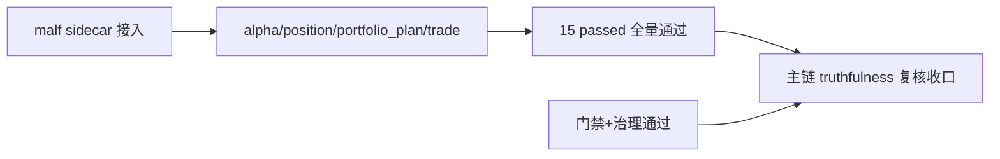

# 主链 truthfulness 复核证据
证据编号：`26`
日期：`2026-04-11`

## 命令

```text
python -m pytest tests/unit/position/test_cli_entrypoint.py tests/unit/system/test_mainline_truthfulness_revalidation.py
python -m pytest tests/unit/alpha/test_runner.py tests/unit/position/test_position_runner.py tests/unit/portfolio_plan/test_runner.py tests/unit/trade/test_trade_runner.py
python .codex/skills/lifespan-execution-discipline/scripts/check_execution_indexes.py --include-untracked
python scripts/system/check_doc_first_gating_governance.py
python scripts/system/check_development_governance.py scripts/position tests/unit/alpha tests/unit/position tests/unit/portfolio_plan tests/unit/trade tests/unit/system docs/03-execution
```

## 关键结果

- 发现并修正正式入口偏差：`scripts/position/run_position_formal_signal_materialization.py` 的 CLI 默认 `--adjust-method` 从错误的 `backward` 改回正式合同要求的 `none`，与 `src/mlq/position/runner.py` 内部默认值重新一致。
- 新增 `tests/unit/position/test_cli_entrypoint.py`，把 CLI 默认价格口径固定为回归检查点，避免再次出现“底层默认正确、脚本默认漂移”的入口偏差。
- 新增 `tests/unit/system/test_mainline_truthfulness_revalidation.py`，以一条 bounded 整链测试贯穿 `structure -> filter -> alpha -> position -> portfolio_plan -> trade`：
  - `structure_snapshot` 挂载 `break/stats sidecar` 字段，但 `structure_progress_state` 仍只由结构输入推进，未被 sidecar 回写。
  - `filter_snapshot` 把 `break_confirmation=confirmed` 与 `exhaustion_risk=high` 作为 note 透传，`trigger_admissible` 仍保持 `True`，证明 sidecar 仍是只读附加而非硬前提。
  - `alpha_trigger_event / alpha_formal_signal_event` 继续只消费官方 `filter_snapshot / structure_snapshot`，未绕过正式账本回读 bridge 中间过程。
  - `position` 使用 `adjust_method='none'` 读取参考价，落表 `reference_trade_date='2026-04-09'`、`reference_price=10.6`、`target_shares=17600`，没有误用同日 `backward` 价格。
  - `trade` 在 `reference_trade_date='2026-04-09'` 之后跳过仅存在于 `backward` 口径的 `2026-04-10`，选择 `none` 口径的下一交易日 `2026-04-11`，证明 `position -> trade` 的 `none` 边界仍真实成立。
- 受影响模块测试共 `15` 项全部通过：
  - `2` 项新增回归测试
  - `13` 项 `alpha / position / portfolio_plan / trade` 目标单测
- 执行索引检查与 `doc-first gating` 通过；按改动范围运行的 `check_development_governance.py` 通过，未引入新的治理债务。

## 产物

- `scripts/position/run_position_formal_signal_materialization.py`
- `tests/unit/position/test_cli_entrypoint.py`
- `tests/unit/system/test_mainline_truthfulness_revalidation.py`
- `tests/unit/alpha/test_runner.py`

## 证据流图


