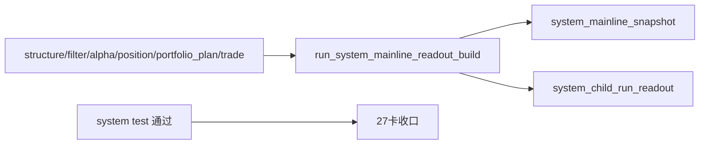

# system 主链 bounded acceptance readout 与 audit bootstrap 证据
证据编号：`27`
日期：`2026-04-11`

## 命令

```text
python -m pytest -p no:cacheprovider --basetemp H:\Lifespan-temp\pytest\system_27 tests/unit/system/test_system_runner.py -q
python -m pytest -p no:cacheprovider --basetemp H:\Lifespan-temp\pytest\system_truth tests/unit/system/test_mainline_truthfulness_revalidation.py -q
python scripts/system/check_doc_first_gating_governance.py
python scripts/system/check_development_governance.py src/mlq/system scripts/system tests/unit/system docs/03-execution
python .codex/skills/lifespan-execution-discipline/scripts/check_execution_indexes.py --include-untracked
```

## 关键结果

- `src/mlq/system` 已正式落地最小四表：
  - `system_run`
  - `system_child_run_readout`
  - `system_mainline_snapshot`
  - `system_run_snapshot`
- `run_system_mainline_readout_build` 只读取官方 `structure / filter / alpha_trigger / alpha_formal_signal / position / portfolio_plan / trade` 账本与 `trade_*` 正式落表结果，不回读私有中间过程。
- 新增 `tests/unit/system/test_system_runner.py`，以一条真实 bounded 主链覆盖 `inserted / reused / rematerialized`：
  - 首次 `system` run 正式插入 `7` 条 child-run readout 与 `1` 条 mainline snapshot。
  - 第二次对同一主链窗口复跑时，`7` 条 child-run readout 全部 `reused`，mainline snapshot 也 `reused`。
  - 当 `trade_run` 更换为新的官方 run id 时，`system` 会新增对应 trade child readout，并把同一自然键下的 `system_mainline_snapshot` 标记为 `rematerialized`。
- `system_mainline_snapshot` 对 `portfolio_id='main_book'`、`snapshot_date='2026-04-09'` 的系统级读数已被测试固定：
  - `acceptance_status='planned_entry_ready'`
  - `planned_entry_count=1`
  - `blocked_upstream_count=0`
  - `planned_carry_count=0`
  - `carried_open_leg_count=1`
  - `current_carry_weight=0.1875`
- 原有 `26` 号卡的整链 truthfulness 测试继续通过，证明 `system` bootstrap 没有反向破坏上游正式合同。
- `doc-first gating`、development governance 与执行索引检查通过，`27` 的闭环文档已补齐。

## 产物

- `src/mlq/system/bootstrap.py`
- `src/mlq/system/runner.py`
- `src/mlq/system/__init__.py`
- `scripts/system/run_system_mainline_readout_build.py`
- `tests/unit/system/test_system_runner.py`
- `docs/03-execution/evidence/27-system-mainline-bounded-acceptance-readout-and-audit-bootstrap-evidence-20260411.md`
- `docs/03-execution/records/27-system-mainline-bounded-acceptance-readout-and-audit-bootstrap-record-20260411.md`
- `docs/03-execution/27-system-mainline-bounded-acceptance-readout-and-audit-bootstrap-conclusion-20260411.md`

## 证据流图


