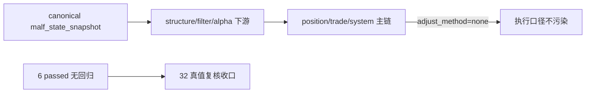

# downstream truthfulness revalidation after malf canonicalization 证据

证据编号：`32`
日期：`2026-04-11`
状态：`已补证据`

## 命令

```text
python scripts/system/check_doc_first_gating_governance.py
pytest -p no:cacheprovider tests/unit/system/test_canonical_malf_rebind.py tests/unit/system/test_mainline_truthfulness_revalidation.py tests/unit/system/test_doc_first_gating_governance.py tests/unit/system/test_system_runner.py -q
```

## 关键结果

- `doc-first gating` 通过，当前待施工卡 `32` 已具备需求、设计、规格、任务分解与历史账本约束。
- `pytest` 通过，结果为 `6 passed`，没有失败。
- 唯一告警是 `PytestConfigWarning: Unknown config option: cache_dir`，属于非阻断噪音。
- `tests/unit/system/test_canonical_malf_rebind.py` 证明默认 `structure / filter / alpha` 已直接读取 canonical `malf_state_snapshot(timeframe='D')`，`alpha formal signal` fallback 已关闭。
- `tests/unit/system/test_mainline_truthfulness_revalidation.py` 证明 canonical downstream 仍可跑通到 `position -> trade -> system` 的 bounded 主链，且 `adjust_method='none'` 维持执行口径不被复权口径污染。

## 产物

- `docs/03-execution/32-downstream-truthfulness-revalidation-after-malf-canonicalization-conclusion-20260411.md`
- `docs/03-execution/B-card-catalog-20260409.md`
- `docs/03-execution/C-system-completion-ledger-20260409.md`

## 证据流图


