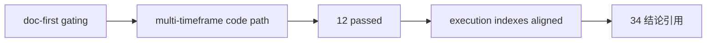

# malf multi-timeframe downstream consumption 证据

证据编号：`34`  
日期：`2026-04-12`  
状态：`已补证据`

## 命令

```text
python scripts/system/check_doc_first_gating_governance.py
python -m py_compile src/mlq/structure/runner.py src/mlq/filter/runner.py src/mlq/alpha/bootstrap.py src/mlq/alpha/trigger_runner.py src/mlq/alpha/runner.py
python -m py_compile tests/unit/structure/test_runner.py tests/unit/filter/test_runner.py tests/unit/alpha/test_runner.py
pytest tests/unit/structure/test_runner.py tests/unit/filter/test_runner.py tests/unit/alpha/test_runner.py -q --basetemp H:\Lifespan-temp\pytest\card34-final
python .codex/skills/lifespan-execution-discipline/scripts/check_execution_indexes.py --include-untracked
```

## 关键结果

- `doc-first gating` 通过；`34-malf-multi-timeframe-downstream-consumption-card-20260411.md` 具备需求、设计、规格、任务分解与历史账本约束。
- `structure / filter / alpha` 相关源码与三份测试文件均通过 `py_compile`。
- `pytest` 结果为 `12 passed in 12.36s`，覆盖 `structure / filter / alpha` 的多周期显式字段、只读透传、monthly 变更 rematerialize 与 alpha 事件落表。
- `structure_snapshot` 已显式物化 `daily_* / weekly_* / monthly_*` 与对应 `source_context_nk`，其中 `D` 仍为主语义，`W/M` 仅按 `latest asof_date <= D asof_date` 只读挂接。
- `filter_snapshot` 已透传多周期字段，并在 `admission_notes` 中只做 sidecar 提示，不将 `W/M` 作为硬拦截条件。
- `alpha_trigger_event / alpha_formal_signal_event` 已显式落表 `daily_source_context_nk + weekly_* + monthly_*`，且高周期变动会进入 rematerialize 指纹。
- 执行索引检查通过；`card / evidence / record / conclusion / catalogs / ledger` 已与当前正式状态一致。

## 产物

- `docs/03-execution/34-malf-multi-timeframe-downstream-consumption-conclusion-20260412.md`
- `docs/03-execution/records/34-malf-multi-timeframe-downstream-consumption-record-20260412.md`
- `src/mlq/structure/bootstrap.py`
- `src/mlq/structure/runner.py`
- `src/mlq/filter/bootstrap.py`
- `src/mlq/filter/runner.py`
- `src/mlq/alpha/bootstrap.py`
- `src/mlq/alpha/trigger_runner.py`
- `src/mlq/alpha/runner.py`
- `tests/unit/structure/test_runner.py`
- `tests/unit/filter/test_runner.py`
- `tests/unit/alpha/test_runner.py`

## 证据结构图


