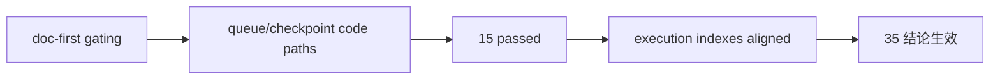

# downstream data-grade checkpoint alignment after malf 证据

证据编号：`35`  
日期：`2026-04-12`  
状态：`已补证据`

## 命令

```text
python scripts/system/check_doc_first_gating_governance.py
python -m py_compile src/mlq/structure/bootstrap.py src/mlq/structure/runner.py src/mlq/filter/bootstrap.py src/mlq/filter/runner.py src/mlq/alpha/bootstrap.py src/mlq/alpha/trigger_runner.py src/mlq/alpha/runner.py
python -m py_compile tests/unit/structure/test_runner.py tests/unit/filter/test_runner.py tests/unit/alpha/test_runner.py
python -m pytest -p no:cacheprovider --basetemp H:\Lifespan-temp\pytest\card35_queue tests/unit/structure/test_runner.py tests/unit/filter/test_runner.py tests/unit/alpha/test_runner.py -q
python .codex/skills/lifespan-execution-discipline/scripts/check_execution_indexes.py --include-untracked
```

## 关键结果

- `doc-first gating` 通过；`35-downstream-data-grade-checkpoint-alignment-after-malf-card-20260411.md` 具备需求、设计、规格、任务分解与历史账本约束。
- `structure / filter / alpha` 的 bootstrap 与 runner 新增 queue/checkpoint 代码路径均通过 `py_compile`。
- `pytest` 结果为 `15 passed`，覆盖原有 bounded/rematerialize 行为以及三条新增默认 queue/checkpoint 路径。
- `structure_work_queue / structure_checkpoint` 已正式落地，并以 canonical `malf checkpoint` 的 `D/W/M` 指纹驱动 `D` 主语义 replay。
- `filter_work_queue / filter_checkpoint` 已正式落地，并以 `structure checkpoint` 的边界与指纹驱动下游 replay。
- `alpha_trigger_work_queue / alpha_trigger_checkpoint` 与 `alpha_formal_signal_work_queue / alpha_formal_signal_checkpoint` 已正式落地，并把上游 checkpoint/fingerprint 变化转化为正式事件账本 rematerialize。
- 默认无窗口运行已不再回退到全窗口重跑；只有显式传入 `signal_start_date / signal_end_date / instruments` 时，runner 才进入 bounded 补跑模式。

## 产物

- `docs/03-execution/35-downstream-data-grade-checkpoint-alignment-after-malf-conclusion-20260412.md`
- `docs/03-execution/records/35-downstream-data-grade-checkpoint-alignment-after-malf-record-20260412.md`
- `src/mlq/structure/bootstrap.py`
- `src/mlq/structure/runner.py`
- `src/mlq/filter/bootstrap.py`
- `src/mlq/filter/runner.py`
- `src/mlq/alpha/bootstrap.py`
- `src/mlq/alpha/trigger_runner.py`
- `src/mlq/alpha/runner.py`
- `tests/unit/structure/test_runner.py`
- `tests/unit/filter/test_runner.py`
- `tests/unit/alpha/test_runner.py`

## 证据结构图


