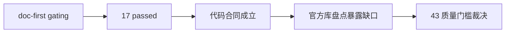

# structure/filter/alpha 达到 data-grade 质量门槛后再进入 position 证据

证据编号：`43`
日期：`2026-04-13`
状态：`已补证据`

## 命令

```text
python scripts/system/check_doc_first_gating_governance.py
python -m pytest tests/unit/structure/test_runner.py tests/unit/filter/test_runner.py tests/unit/alpha/test_runner.py --basetemp H:\Lifespan-temp\pytest-tmp\card-43 -o cache_dir=H:\Lifespan-temp\pytest-cache\card-43 -q
@'
import duckdb
from pathlib import Path
checks = {
    "malf": ["malf_state_snapshot", "malf_canonical_checkpoint", "malf_same_level_stats", "pivot_confirmed_break_ledger"],
    "structure": ["structure_snapshot", "structure_work_queue", "structure_checkpoint", "structure_run_snapshot"],
    "filter": ["filter_snapshot", "filter_work_queue", "filter_checkpoint", "filter_run_snapshot"],
    "alpha": ["alpha_trigger_event", "alpha_trigger_work_queue", "alpha_trigger_checkpoint", "alpha_formal_signal_event", "alpha_formal_signal_work_queue", "alpha_formal_signal_checkpoint", "alpha_family_event"],
}
...
'@ | python -
@'
import duckdb
path = r"H:\Lifespan-data\alpha\alpha.duckdb"
...
'@ | python -
```

## 关键结果

- `doc-first gating` 通过；当前待施工卡 `43-structure-filter-alpha-data-grade-quality-gate-before-position-card-20260413.md` 已具备需求、设计、规格、任务分解与历史账本约束。
- 串行 `pytest` 结果为 `17 passed`，覆盖 `structure / filter / alpha` 的 bounded 路径、默认 `checkpoint_queue` 路径、上游 `source_fingerprint` 变化触发 rematerialize，以及 `alpha formal signal -> position` 的最小可消费链路。
- 代码层面已经具备进入 pre-position 硬化链的正式合同：
  - `structure` 强制只读 canonical `malf_state_snapshot(timeframe='D')`
  - `filter` 强制只读 `structure_snapshot + canonical malf`
  - `alpha trigger / formal signal` 默认无窗口调用已切到 `queue + checkpoint + rematerialize`
- 官方本地账本 `H:\Lifespan-data` 尚未达到与代码同级的 data-grade 质量：
  - `malf.duckdb` 缺少 `malf_state_snapshot / malf_canonical_checkpoint / malf_same_level_stats / pivot_confirmed_break_ledger`
  - `structure.duckdb` 缺少 `structure_work_queue / structure_checkpoint`
  - `filter.duckdb` 缺少 `filter_work_queue / filter_checkpoint`
  - `alpha.duckdb` 缺少 `alpha_trigger_work_queue / alpha_trigger_checkpoint / alpha_formal_signal_work_queue / alpha_formal_signal_checkpoint`
- `alpha_formal_signal_event` 的官方表结构仍保留 `malf_context_4 / lifecycle_rank_high / lifecycle_rank_total` compat-only 字段；`42` 冻结的 family 正式解释层尚未物理升级为 formal signal 的稳定 producer 合同。
- 因此，`43` 可以接受“继续进入 `44 -> 46` 的 pre-position 硬化链”，但不能接受“直接进入 `47 -> 55` 或恢复 `100 -> 105`”。

## 产物

- `docs/03-execution/43-structure-filter-alpha-data-grade-quality-gate-before-position-conclusion-20260413.md`
- `docs/03-execution/records/43-structure-filter-alpha-data-grade-quality-gate-before-position-record-20260413.md`
- `docs/03-execution/00-conclusion-catalog-20260409.md`
- `docs/03-execution/B-card-catalog-20260409.md`
- `docs/03-execution/C-system-completion-ledger-20260409.md`
- `docs/03-execution/A-execution-reading-order-20260409.md`
- `docs/02-spec/Ω-system-delivery-roadmap-20260409.md`

## 证据结构图


