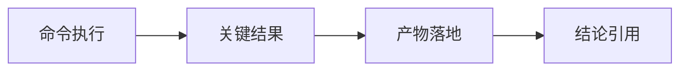

# structure/filter 官方 ledger replay 与 smoke 硬化 证据

证据编号：`44`
日期：`2026-04-13`

## 命令

```text
待补：structure/filter 官方 ledger replay / smoke 命令
```

## 关键结果

- 待补：structure official ledger replay 结果
- 待补：filter official ledger smoke 结果

## 产物

- 待补：H:\Lifespan-report\...
- 待补：official ledger readout / summary 路径

## 证据结构图


