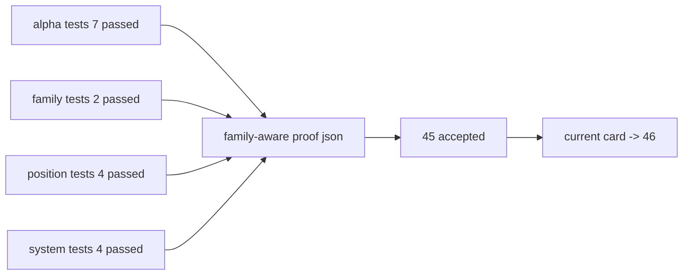

# alpha formal signal producer 在进入 position 前硬化证据

证据编号：`45`
日期：`2026-04-13`

## 开卡状态
1. `44-structure-filter-official-ledger-replay-smoke-hardening-conclusion-20260413.md` 已生效，允许主线进入 `45`。
2. `45` 对应的 design / spec / card / evidence / record / conclusion 文档束已齐备。
3. 本轮证据覆盖 `alpha formal signal` 的 family-aware 物理接入、queue replay 证明和 `position` 消费合同兼容验证。

## 命令证据
1. `python -m pytest -p no:cacheprovider --basetemp H:\Lifespan-temp\pytest\card45_alpha tests\unit\alpha\test_runner.py -q`
   - 结果：`7 passed, 1 warning in 12.65s`
2. `python -m pytest -p no:cacheprovider --basetemp H:\Lifespan-temp\pytest\card45_alpha_family tests\unit\alpha\test_family_runner.py -q`
   - 结果：`2 passed, 1 warning in 5.95s`
3. `python -m pytest -p no:cacheprovider --basetemp H:\Lifespan-temp\pytest\card45_position tests\unit\position\test_position_runner.py -q`
   - 结果：`4 passed, 1 warning in 2.26s`
4. `python -m pytest -p no:cacheprovider --basetemp H:\Lifespan-temp\pytest\card45_system tests\unit\system\test_canonical_malf_rebind.py tests\unit\system\test_mainline_truthfulness_revalidation.py tests\unit\system\test_system_runner.py -q`
   - 结果：`4 passed, 1 warning in 10.50s`
5. `python .codex/skills/lifespan-execution-discipline/scripts/check_execution_indexes.py --include-untracked`
   - 结果：通过
6. `python scripts/system/check_development_governance.py`
   - 结果：仅剩仓库既有 data 文件长度历史债务；本卡无新增治理违规

## 受控 proof 产物
1. `H:\Lifespan-temp\card45\family-aware-proof\summary\alpha_formal_signal_family_aware_proof.json`
   - 保存 bounded build 与 queue replay 的正式 proof 摘要
2. `H:\Lifespan-report\card45\alpha-formal-signal-producer-inventory-readout-20260413.md`
   - 保存人读版 readout

## 关键结果
1. `alpha formal signal` 正式输入已经提升为：
   - `alpha_trigger_event`
   - `alpha_family_event`
   - `filter_snapshot`
   - `structure_snapshot`
2. `alpha_formal_signal_run` 新增 `source_family_table` 审计列，并在 bounded 与 checkpoint queue summary 中稳定回填 `alpha_family_event`。
3. `alpha_formal_signal_event` 已物理接入 family 解释键：
   - `source_family_event_nk`
   - `family_code`
   - `source_family_contract_version`
   - `family_role`
   - `family_bias`
   - `malf_alignment`
   - `malf_phase_bucket`
   - `family_source_context_fingerprint`
4. `alpha_formal_signal_run_event` 已物理接入关键 family 透传列：
   - `source_family_event_nk`
   - `family_code`
   - `family_role`
   - `malf_alignment`
   - `family_source_context_fingerprint`
5. `alpha formal signal` 合同版本已从 `alpha-formal-signal-v2` 升级为 `alpha-formal-signal-v3`，proof 中可见：
   - bounded summary `signal_contract_version='alpha-formal-signal-v3'`
   - bounded / queue summary `source_family_table='alpha_family_event'`
6. family-only 变化现在会触发 queue replay：
   - 手动修改 `alpha_family_event.payload_json` 中的 `family_role / malf_alignment / source_context_fingerprint`
   - 第二轮 queue 运行得到 `rematerialized_count=1`
   - 最新 `alpha_formal_signal_work_queue` 行为：`queue_status='completed'`、`dirty_reason='source_fingerprint_changed'`
   - 最新 checkpoint：`last_run_id='card45-proof-formal-queue-b'`
   - 最新 `alpha_formal_signal_event` 已更新为 `family_role='warning'`、`malf_alignment='conflicted'`、`family_source_context_fingerprint='proof-family-fingerprint-b'`
7. `position` 对 `alpha formal signal` 的消费合同已同步兼容升级：
   - 读取 family-aware 新列时可正常落入 `PositionFormalSignalInput`
   - 当上游旧表缺列时仍回退为 `NULL AS ...`，不破坏兼容路径
   - position 单测确认新列存在时仍可正常产出 candidate，且 `source_signal_run_id='alpha-formal-run-111'`

## 裁决支撑
1. `45` 已不再是“只有 queue 语义、没有 family-aware producer”的中间状态。
2. 当前证据足以接受 `45`，并把当前施工位前移到 `46`。
3. 当前证据不足以跳过 `46`；`47 -> 55` 仍等待 integrated acceptance。
4. `100 -> 105` 仍等待 `55` 接受后再恢复。

## 证据结构图

