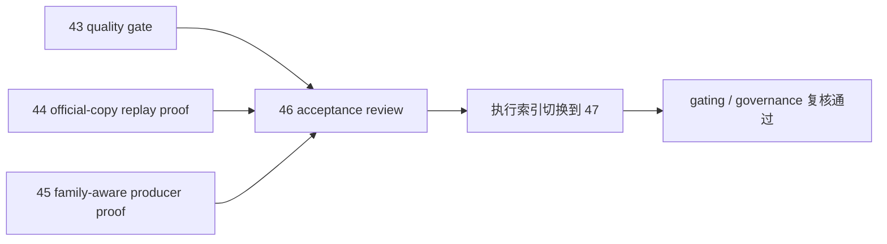

# 进入 position 前的 upstream acceptance gate 证据

证据编号：`46`
日期：`2026-04-13`
状态：`已补证据`

## 开卡状态
1. `45-alpha-formal-signal-producer-hardening-before-position-conclusion-20260413.md` 已生效，允许主线进入 `46`。
2. `46` 对应的 design / spec / card / evidence / record / conclusion 文档束已齐备。
3. 本轮证据只做系统级 acceptance 复核，不新增 `position` 实现，也不提前解冻 `100 -> 105`。

## 命令证据
1. `python scripts/system/check_doc_first_gating_governance.py`
   - 结果：通过；切索引前的当前待施工卡 `46-pre-position-upstream-acceptance-gate-card-20260413.md` 已具备需求、设计、规格、任务分解与历史账本约束。
2. `@' ... '@ | python -X utf8 -`
   - 结果：复核 `43 / 44 / 45` 的正式输入与 proof 产物全部存在：
     - `43_conclusion=True`
     - `44_conclusion=True`
     - `45_conclusion=True`
     - `43_evidence=True`
     - `44_card44_structure_run_2=True`
     - `44_card44_filter_run_2=True`
     - `45_proof_json=True`
     - `45_report=True`
3. `@' ... '@ | python -X utf8 -`
   - 结果：读取 card44/card45 proof 摘要，得到：
     - `structure-run-2`：`rematerialized_count=1`、`checkpoint_upserted_count=1`
     - `filter-run-2`：`rematerialized_count=1`、`checkpoint_upserted_count=1`
     - `card45` bounded proof：`signal_contract_version='alpha-formal-signal-v3'`、`source_family_table='alpha_family_event'`
     - `card45` queue replay：`rematerialized_count=1`、`dirty_reason='source_fingerprint_changed'`、`last_run_id='card45-proof-formal-queue-b'`
4. `python scripts/system/check_doc_first_gating_governance.py`
   - 结果：切索引后再次通过；新的当前待施工卡 `47-position-malf-context-driven-sizing-and-batch-contract-card-20260413.md` 已具备正式前置输入。
5. `python .codex/skills/lifespan-execution-discipline/scripts/check_execution_indexes.py --include-untracked`
   - 结果：通过；执行索引、结论目录与完成账本切换一致。
6. `python scripts/system/check_development_governance.py`
   - 结果：通过；仅剩仓库既有历史治理债务，本轮未引入新增违规。

## 关键结果

1. `43` 已正式裁决上游代码合同达到进入 pre-position 硬化链的质量门槛，但不得直接进入 `47 -> 55`。
2. `44` 的受控 official-copy proof 已证明 `structure / filter` 默认 queue 模式可以形成真实 replay / rematerialize：
   - `H:\Lifespan-temp\card44\summary\structure-run-2.json`
   - `H:\Lifespan-temp\card44\summary\filter-run-2.json`
3. `45` 已把 `alpha formal signal` 升级为 family-aware 正式 producer，并证明 family-only 变化会触发 queue replay：
   - `signal_contract_version='alpha-formal-signal-v3'`
   - `source_family_table='alpha_family_event'`
   - `queue_status='completed'`
   - `dirty_reason='source_fingerprint_changed'`
4. 当前阻断已不再位于 `structure / filter / alpha` upstream；`46` 可以接受“进入 `47 -> 55`”，但仍不能接受“提前恢复 `100 -> 105`”。
5. 切索引后，仓库正式口径已统一为：
   - 最新生效结论锚点：`46-pre-position-upstream-acceptance-gate-conclusion-20260413.md`
   - 当前待施工卡：`47-position-malf-context-driven-sizing-and-batch-contract-card-20260413.md`

## 产物

1. `docs/03-execution/46-pre-position-upstream-acceptance-gate-conclusion-20260413.md`
2. `docs/03-execution/records/46-pre-position-upstream-acceptance-gate-record-20260413.md`
3. `docs/03-execution/00-conclusion-catalog-20260409.md`
4. `docs/03-execution/B-card-catalog-20260409.md`
5. `docs/03-execution/C-system-completion-ledger-20260409.md`
6. `docs/03-execution/A-execution-reading-order-20260409.md`
7. `docs/02-spec/Ω-system-delivery-roadmap-20260409.md`
8. `README.md`
9. `AGENTS.md`
10. `H:\Lifespan-temp\card44\summary\structure-run-2.json`
11. `H:\Lifespan-temp\card44\summary\filter-run-2.json`
12. `H:\Lifespan-temp\card45\family-aware-proof\summary\alpha_formal_signal_family_aware_proof.json`
13. `H:\Lifespan-report\card45\alpha-formal-signal-producer-inventory-readout-20260413.md`

## 证据结构图

