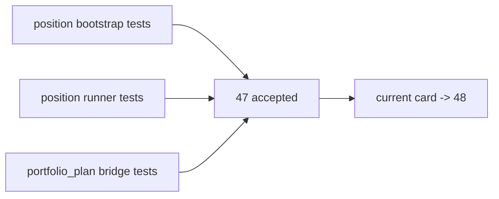

# position MALF 驱动仓位与分批合同冻结证据

证据编号：`47`
日期：`2026-04-14`

## 开卡状态
1. `46-pre-position-upstream-acceptance-gate-conclusion-20260413.md` 已生效，允许主线进入 `47`。
2. `47` 对应 design / spec / card 文档束齐备，`check_doc_first_gating_governance.py` 可识别正式前置输入。
3. 本轮证据覆盖 schema 升级、MALF context mapping、entry/exit plan 落表与 `portfolio_plan` 兼容验证。

## 命令证据
1. `python -m pytest -p no:cacheprovider --basetemp H:\Lifespan-temp\pytest\card47_position H:\lifespan-0.01\tests\unit\position\test_bootstrap.py -q`
   - 结果：`6 passed, 1 warning in 5.49s`
2. `python -m pytest -p no:cacheprovider --basetemp H:\Lifespan-temp\pytest\card47_position_runner H:\lifespan-0.01\tests\unit\position\test_position_runner.py -q`
   - 结果：`4 passed, 1 warning in 5.00s`
3. `python -m pytest -p no:cacheprovider --basetemp H:\Lifespan-temp\pytest\card47_portfolio_plan H:\lifespan-0.01\tests\unit\portfolio_plan\test_runner.py -q`
   - 结果：`3 passed, 1 warning in 7.74s`
4. `python -m pytest -p no:cacheprovider --basetemp H:\Lifespan-temp\pytest\card47_cli H:\lifespan-0.01\tests\unit\position\test_cli_entrypoint.py -q`
   - 结果：`1 passed, 1 warning in 0.69s`
5. `python scripts/system/check_doc_first_gating_governance.py`
   - 结果：通过，当前待施工卡 `48-position-risk-budget-and-capacity-ledger-hardening-card-20260413.md` 已具备正式前置输入
6. `python .codex/skills/lifespan-execution-discipline/scripts/check_execution_indexes.py --include-untracked`
   - 结果：通过
7. `python scripts/system/check_development_governance.py`
   - 结果：仍报仓库既有 `src/mlq/data/data_mainline_incremental_sync.py` 文件长度历史债务；本卡无新增治理违规

## 关键结果
1. `position_policy_registry` 已新增：
   - `position_contract_version`
   - `entry_schedule_stage_default / entry_schedule_lag_days_default`
   - `trim_schedule_stage_default / trim_schedule_lag_days_default`
   - `exit_schedule_stage_default / exit_schedule_lag_days_default`
2. `position_candidate_audit / position_capacity_snapshot / position_sizing_snapshot` 已正式接入：
   - `context_behavior_profile`
   - `deployment_stage`
   - `candidate/sizing contract version`
   - `schedule_stage / schedule_lag_days`
3. `position_entry_leg_plan` 已正式落表，并验证：
   - `BULL_MAINSTREAM` 初始窗口会生成 `initial_entry / add_on_confirmation / add_on_continuation`
   - 当前 deployment 未达到的加仓腿会以 `deferred` 方式保留
4. `position_exit_plan / position_exit_leg` 已验证：
   - 超出 context cap 时落出 `trim`
   - blocked 且已有持仓时落出 `terminal_exit`
5. `portfolio_plan` 现有 bridge 仍保持兼容：
   - 继续只读 `position_candidate_audit / position_capacity_snapshot / position_sizing_snapshot`
   - 单测未因 `47` 的 schema 升级而回归失败

## 裁决支撑
1. `47` 已不再是“只有单个 `target_weight`”的 bounded materialization。
2. 当前证据足以接受 `47`，并把当前施工位前移到 `48`。
3. 当前证据不足以代替 `48-50`；risk budget、capacity decomposition hardening 与 data-grade runner 仍待后续卡片完成。

## 证据结构图

