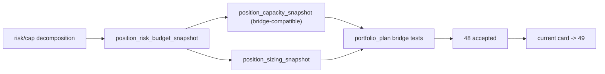

# position risk budget 与 capacity ledger 硬化证据

证据编号：`48`
日期：`2026-04-14`
状态：`已补证据`

## 开卡状态
1. `47-position-malf-context-driven-sizing-and-batch-contract-conclusion-20260414.md` 已生效，允许主线进入 `48`。
2. `48` 对应 design / spec / card 已齐备，`check_doc_first_gating_governance.py` 可识别正式前置输入。
3. 本轮证据覆盖 `position_risk_budget_snapshot` 新账本、`capacity / sizing` 兼容派生、`portfolio_plan` bridge 不回归与 execution 索引切换。

## 命令证据
1. `python -m py_compile src/mlq/position/position_contract_logic.py src/mlq/position/position_bootstrap_schema.py src/mlq/position/position_materialization.py src/mlq/position/position_shared.py src/mlq/position/bootstrap.py src/mlq/position/runner.py src/mlq/portfolio_plan/runner.py`
   - 结果：通过
2. `python -m pytest -p no:cacheprovider --basetemp H:\Lifespan-temp\pytest\card48_position_risk_budget tests/unit/position/test_bootstrap.py tests/unit/position/test_position_runner.py tests/unit/position/test_cli_entrypoint.py tests/unit/portfolio_plan/test_runner.py -q`
   - 结果：`14 passed, 1 warning in 23.06s`
3. `python scripts/system/check_doc_first_gating_governance.py`
   - 结果：通过；切索引后当前待施工卡 `49-position-batched-entry-trim-and-partial-exit-contract-card-20260413.md` 仍具备正式前置输入
4. `python .codex/skills/lifespan-execution-discipline/scripts/check_execution_indexes.py --include-untracked`
   - 结果：通过
5. `python scripts/system/check_development_governance.py`
   - 结果：仍只报既有历史债务：
     - `src/mlq/data/data_mainline_incremental_sync.py (1013 行)`
     - 若干既有 `800+` 目标超长文件
   - 本卡相关文件未新增治理违规，`src/mlq/position/position_materialization.py` 已收敛到 `715` 行

## 关键结果
1. `position_risk_budget_snapshot` 已正式落表并冻结：
   - `risk_budget_weight`
   - `context_cap_weight`
   - `single_name_cap_weight`
   - `portfolio_cap_weight`
   - `final_allowed_position_weight`
   - `required_reduction_weight`
   - `binding_cap_code`
   - `capacity_source_code`
2. `position_capacity_snapshot` 已升级为兼容派生快照，并显式关联 `risk_budget_snapshot_nk`。
3. `position_sizing_snapshot` 已显式绑定 `risk_budget_snapshot_nk`，runner / bootstrap summary 已新增 `risk_budget_count`。
4. `FIXED_NOTIONAL_CONTROL` 已被实现为 operating baseline；`SINGLE_LOT_CONTROL` 仍保留在 family snapshot 中承担 floor sanity，而不再与主容量逻辑并列争夺主导权。
5. `portfolio_plan` 现有 bridge 继续只消费 `position_candidate_audit / position_capacity_snapshot / position_sizing_snapshot`；相关单测未因 `48` 的 schema 升级而回归失败。

## 裁决支撑
1. `48` 已把 `position` 中原本停留在临时变量内的 risk/capacity 约束拆成正式厚账本。
2. 当前证据足以接受 `48`，并把当前施工位前移到 `49`。
3. 当前证据不足以替代 `49-50`；batched partial-exit contract 与 data-grade runner 仍待后续卡片完成。

## 证据结构图

