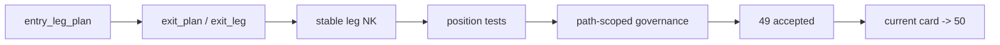

# position 分批进场、trim 与 partial-exit 合同冻结证据

证据编号：`49`
日期：`2026-04-14`
状态：`已补证据`

## 开卡状态
1. `48-position-risk-budget-and-capacity-ledger-hardening-conclusion-20260414.md` 已生效，允许主线进入 `49`。
2. `49` 对应 design / spec / card 已齐备，`check_doc_first_gating_governance.py` 可识别正式前置输入。
3. 本轮证据覆盖 `position_entry_leg_plan / position_exit_plan / position_exit_leg` 的 leg-aware 合同、退出腿自然键重构、`scale_out` 计划头落表与执行索引切换。

## 命令证据
1. `python -m pytest tests/unit/position/test_bootstrap.py tests/unit/position/test_position_runner.py -q --basetemp H:/Lifespan-temp/pytest-tmp/position49`
   - 结果：`11 passed in 3.72s`
2. `python -m pytest tests/unit/position -q --basetemp H:/Lifespan-temp/pytest-tmp/position49-all`
   - 结果：`12 passed in 4.31s`
3. `python scripts/system/check_doc_first_gating_governance.py`
   - 结果：通过；当前待施工卡 `49-position-batched-entry-trim-and-partial-exit-contract-card-20260413.md` 具备正式前置输入
4. `python scripts/system/check_development_governance.py src/mlq/position/position_bootstrap_schema.py src/mlq/position/position_contract_logic.py src/mlq/position/position_materialization.py tests/unit/position/test_bootstrap.py tests/unit/position/test_position_runner.py`
   - 结果：通过；本次改动范围没有新增文件长度、中文治理、仓库卫生或文档先行违规
5. `python scripts/system/check_development_governance.py`
   - 结果：仍只报仓库既有历史超长文件：
     - `src/mlq/data/data_mainline_incremental_sync.py (1013 行)`
     - 若干既有 `800+` 目标超长文件
   - 本卡相关文件未新增治理违规

## 关键结果
1. `position_entry_leg_plan` 保持首批、确认加仓、延续加仓三腿合同，并继续用 `entry_leg_nk = candidate_nk + leg_role + schedule_stage + contract_version` 冻结自然键。
2. `position_exit_plan / position_exit_leg` 已升级为正式 leg-aware 合同：
   - `trim` 保留保护性减仓计划
   - `scale_out` 作为非紧急 partial-exit 计划头正式落表
   - `terminal_exit` 既可作为独立 closeout 计划，也可作为 `scale_out` 第二腿
3. `exit_leg_nk` 已不再依赖 `exit_leg_seq` 充当主语义，而改为 `candidate_nk + leg_role + schedule_stage + contract_version` 稳定复算。
4. `position_policy_registry` 与默认 seed 已前移到 `position-malf-batched-entry-exit-v2`，使 `49` 的新腿合同可与 `47-48` 旧事实并行留痕。
5. `fixed_notional_naive_trail_scale_out_50_50_v1` 已在单测中证明可生成：
   - `scale_out` 计划头
   - 第一腿 `scale_out`
   - 第二腿 `terminal_exit`

## 裁决支撑
1. `49` 已把 `position` 从“只有 allowed weight、只有单腿 trim/closeout”提升到“带多腿 entry / exit 计划合同”的正式状态。
2. 当前证据足以接受 `49`，并把当前施工位前移到 `50`。
3. 当前证据仍不足以替代 `50-51`；queue / checkpoint / replay 与 pre-portfolio-plan acceptance 仍待后续卡片完成。

## 证据结构图

