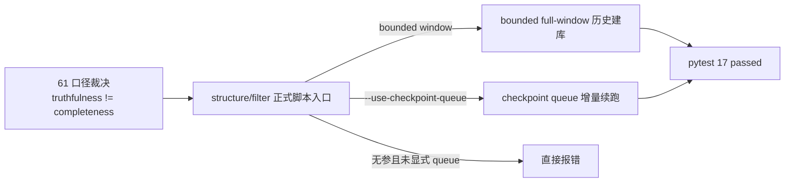

# structure filter tail coverage truthfulness rectification 证据
`证据编号`：`61`
`日期`：`2026-04-15`

## 本轮重开范围

`61` 首轮收口已经完成了 truthfulness 与 completeness 的口径裁决，但执行入口仍存在一个落地缺口：

1. `scripts/structure/run_structure_snapshot_build.py`
2. `scripts/filter/run_filter_snapshot_build.py`

两者在无参调用时都会默认走 checkpoint queue。该行为对“每日增量续跑”是正确的，但对 `78-84` 的历史窗口建库并不安全，因为它会把 `61` 已经裁决的“bounded full-window 才是历史建库主路径”停留在文档层，而没有落到正式脚本入口层。

## 本轮实现与验证命令

1. 结构 / filter 相关单测

```bash
python -m pytest tests/unit/structure/test_runner.py tests/unit/structure/test_explicit_queue_mode.py tests/unit/filter/test_runner.py
```

- 结果：通过
- 摘要：`17 passed in 9.57s`

2. 当前待施工卡文档门禁

```bash
python scripts/system/check_doc_first_gating_governance.py
```

- 结果：通过
- 摘要：当前待施工卡 `62-filter-pre-trigger-boundary-and-authority-reset-card-20260415.md` 已具备 requirement / design / spec / task breakdown 与历史账本约束

3. 全仓治理盘点

```bash
python scripts/system/check_development_governance.py
```

- 结果：未通过，但失败原因为历史 file-length backlog，而非本轮新增违规
- 盘点摘要：
  - 硬上限遗留：`src/mlq/data/data_mainline_incremental_sync.py`、`src/mlq/portfolio_plan/runner.py`
  - 目标上限遗留：`src/mlq/alpha/bootstrap.py`、`src/mlq/data/data_market_base_materialization.py`、`src/mlq/data/data_tdxquant.py`、`tests/unit/alpha/test_runner.py`、`tests/unit/data/test_market_base_runner.py`
  - 本轮触达文件已回到目标线以内：`src/mlq/filter/runner.py = 788 行`、`tests/unit/structure/test_runner.py = 768 行`

4. 按本轮改动范围执行严格治理检查

```bash
python scripts/system/check_development_governance.py AGENTS.md README.md pyproject.toml scripts/filter/run_filter_snapshot_build.py scripts/structure/run_structure_snapshot_build.py src/mlq/filter/runner.py src/mlq/structure/runner.py tests/unit/filter/test_runner.py tests/unit/structure/test_explicit_queue_mode.py docs/03-execution/61-structure-filter-tail-coverage-truthfulness-rectification-conclusion-20260415.md docs/03-execution/61-structure-filter-tail-coverage-truthfulness-rectification-evidence-20260415.md docs/03-execution/61-structure-filter-tail-coverage-truthfulness-rectification-record-20260415.md
```

- 结果：通过
- 摘要：
  - 本轮改动范围没有文件超过 1000 行硬上限
  - 新增测试文件已补齐中文注释
  - `AGENTS.md / README.md / pyproject.toml` 已同步刷新，入口联动检查通过

## 落地事实

### 1. 正式脚本入口不再允许“无参静默 queue”

本轮为两个正式入口增加显式 queue 开关：

1. `scripts/structure/run_structure_snapshot_build.py`
2. `scripts/filter/run_filter_snapshot_build.py`

新口径：

- 显式给出 `signal_start_date / signal_end_date`：走 bounded full-window
- 显式给出 `--use-checkpoint-queue`：走 checkpoint queue
- 既不给 bounded window，也不给 `--use-checkpoint-queue`：直接报错，不再静默进入 queue

### 2. runner 层保留原有增量语义

本轮没有改写 queue 引擎本身，只新增了“正式脚本入口可要求显式 queue”的防呆参数：

1. `src/mlq/structure/runner.py`
2. `src/mlq/filter/runner.py`

因此：

- 正式 CLI 入口更安全
- 既有内部调用与单测仍可继续使用 queue default / `use_checkpoint_queue=True`
- `61` 的裁决第一次落到“执行口径”而不是只停留在文档口径

### 3. 入口文件同步已补齐

`AGENTS.md`、`README.md` 与 `pyproject.toml` 已同步到当前正式口径：

- 最新生效结论锚点：`61-structure-filter-tail-coverage-truthfulness-rectification-conclusion-20260415.md`
- 当前待施工卡：`62-filter-pre-trigger-boundary-and-authority-reset-card-20260415.md`
- `structure/filter` 正式 CLI：必须显式选择 bounded full-window 或 `--use-checkpoint-queue`

## 变更文件

| 类型 | 路径 | 说明 |
| --- | --- | --- |
| 代码 | `src/mlq/structure/runner.py` | 增加显式 queue 模式校验 |
| 代码 | `src/mlq/filter/runner.py` | 增加显式 queue 模式校验 |
| 脚本 | `scripts/structure/run_structure_snapshot_build.py` | 暴露 `--use-checkpoint-queue`，并要求 CLI 显式选择 queue |
| 脚本 | `scripts/filter/run_filter_snapshot_build.py` | 暴露 `--use-checkpoint-queue`，并要求 CLI 显式选择 queue |
| 测试 | `tests/unit/structure/test_explicit_queue_mode.py` | 覆盖 structure 显式 queue 入口 |
| 测试 | `tests/unit/filter/test_runner.py` | 覆盖 filter 显式 queue 入口 |
| 入口 | `AGENTS.md` | 同步 `61/62` 执行索引与 structure/filter 显式执行模式要求 |
| 入口 | `README.md` | 同步 `61/62` 执行索引与 structure/filter 显式执行模式要求 |
| 入口 | `pyproject.toml` | 同步到 `61/62` 当前口径 |
| 文档 | `docs/03-execution/61-*.md` | 回填重开后的 evidence / record / conclusion |

## 证据结构图


