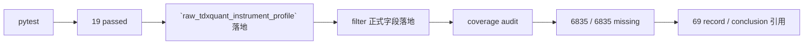

# filter 客观可交易性与标的宇宙 gate 冻结 证据

证据编号：`69`
日期：`2026-04-15`

## 命令

```text
python -m pytest tests/unit/data/test_tdxquant_runner.py tests/unit/filter/test_runner.py tests/unit/alpha/test_pas_runner.py tests/unit/alpha/test_formal_signal_runner.py -q --basetemp H:\Lifespan-temp\pytest-tmp\codex-filter-objective
```

```text
python -m pytest tests/unit/filter/test_objective_coverage_audit.py tests/unit/filter/test_runner.py tests/unit/data/test_tdxquant_runner.py tests/unit/alpha/test_pas_runner.py tests/unit/alpha/test_formal_signal_runner.py -q --basetemp H:\Lifespan-temp\pytest-tmp\codex-filter-coverage-full
```

```text
python scripts/filter/run_filter_objective_coverage_audit.py --group-limit 20 --summary-path H:\Lifespan-report\filter\filter-objective-coverage-audit-20260415.json --report-path H:\Lifespan-report\filter\filter-objective-coverage-audit-20260415.md
```

## 关键结果

- `17 passed in 15.23s`
- `19 passed in 86.44s`
- `raw_market.raw_tdxquant_instrument_profile` 已具备正式 schema 与代码落地，并由 `run_tdxquant_daily_raw_sync(...)` 负责沉淀 objective status
- `filter_snapshot / filter_run_snapshot` 已正式落 `filter_gate_code / filter_reject_reason_code`
- `alpha formal signal` 已优先消费正式 gate/reject 字段，并保留 legacy 回退
- 官方 `filter_snapshot` 当前共有 `6835` 行，`raw_market.raw_tdxquant_instrument_profile` 在官方 raw DB 中尚不存在，因此 objective coverage missing=`6835 / 6835 = 100%`
- 覆盖审计建议的最小 backfill 窗口为 `2010-01-04 -> 2026-04-08`
- 审计产物已输出到 `H:\Lifespan-report\filter\filter-objective-coverage-audit-20260415.json` 与 `H:\Lifespan-report\filter\filter-objective-coverage-audit-20260415.md`

## 产物

- `src/mlq/data/bootstrap.py`
- `src/mlq/data/tdxquant.py`
- `src/mlq/data/data_tdxquant.py`
- `src/mlq/data/data_tdxquant_support.py`
- `src/mlq/filter/filter_shared.py`
- `src/mlq/filter/filter_source.py`
- `src/mlq/filter/runner.py`
- `src/mlq/filter/filter_materialization.py`
- `src/mlq/filter/bootstrap.py`
- `src/mlq/filter/objective_coverage_audit.py`
- `src/mlq/alpha/formal_signal_source.py`
- `scripts/filter/run_filter_objective_coverage_audit.py`
- `tests/unit/data/test_tdxquant_runner.py`
- `tests/unit/filter/test_runner.py`
- `tests/unit/filter/test_objective_coverage_audit.py`
- `tests/unit/alpha/test_pas_runner.py`
- `tests/unit/alpha/test_formal_signal_runner.py`

## 证据结构图

