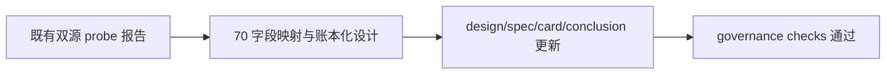

# 70-历史 objective profile 回补源选型与治理证据
`日期：2026-04-15`
`对应卡片：70-historical-objective-profile-backfill-source-selection-and-governance-card-20260415.md`

## 执行命令

```powershell
Get-Content docs/03-execution/70-historical-objective-profile-backfill-source-selection-and-governance-card-20260415.md
Get-Content docs/01-design/modules/data/07-historical-objective-profile-backfill-source-selection-and-governance-charter-20260415.md
Get-Content docs/02-spec/modules/data/07-historical-objective-profile-backfill-source-selection-and-governance-spec-20260415.md
Get-Content docs/03-execution/70-historical-objective-profile-backfill-source-selection-and-governance-conclusion-20260415.md
Get-Content docs/02-spec/modules/filter/01-filter-formal-snapshot-spec-20260409.md
Get-Content docs/01-design/modules/data/04-tdxquant-daily-raw-source-ledger-bridge-charter-20260410.md
python scripts/system/check_development_governance.py
python scripts/system/check_doc_first_gating_governance.py
```

## 关键结果

- `70` 当前已从“probe 选型卡”继续推进到“主源字段映射与账本化设计卡”。
- 已书面冻结 `Tushare` 四接口的职责分层：
  - `stock_basic` 负责 universe / `market_type` / `security_type` / `list_status`
  - `suspend_d` 负责 `suspension_status`
  - `stock_st` 负责 `2016-01-01` 之后 `risk_warning_status`
  - `namechange` 负责 `2010-2015` 风险警示补齐，并作为 `delisting_arrangement` 候选来源
- 已书面冻结两层账本形态：
  - `raw_market.tushare_objective_run / request / checkpoint / event`
  - `raw_market.raw_tdxquant_instrument_profile`
- 已书面冻结后续实现卡的最小自然键、批量建仓、增量更新与 checkpoint 口径。
- `Baostock` 继续被限定为 `tradestatus / isST` 交叉验证源，不作为完整历史主源。
- `check_development_governance.py` 与 `check_doc_first_gating_governance.py` 通过。

## 产物

- `H:\Lifespan-report\data\objective-source-probe-20260415.json`
- `H:\Lifespan-report\data\objective-source-probe-20260415-tushare.json`
- `H:\Lifespan-report\data\objective-source-probe-20260415-tushare-detail.json`
- `H:\Lifespan-report\data\objective-source-probe-20260415-tushare-st-alternatives.json`
- `H:\Lifespan-report\data\objective-source-probe-20260415-tushare-coverage-floor.json`
- `H:\Lifespan-report\data\objective-source-probe-20260415-baostock-detail.json`
- `H:\Lifespan-report\data\objective-source-probe-20260415-baostock-bj.json`
- `H:\Lifespan-report\data\objective-source-probe-20260415-summary.json`
- `H:\Lifespan-report\data\objective-source-probe-20260415.md`
- `docs/01-design/modules/data/07-historical-objective-profile-backfill-source-selection-and-governance-charter-20260415.md`
- `docs/02-spec/modules/data/07-historical-objective-profile-backfill-source-selection-and-governance-spec-20260415.md`
- `docs/03-execution/70-historical-objective-profile-backfill-source-selection-and-governance-card-20260415.md`
- `docs/03-execution/70-historical-objective-profile-backfill-source-selection-and-governance-conclusion-20260415.md`

## 证据结构图


