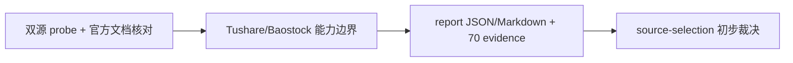

# 历史 objective profile 回补源选型与治理证据

`证据编号：70`
`日期：2026-04-15`

## 命令

```text
python .codex/skills/lifespan-execution-discipline/scripts/new_execution_bundle.py --number 70 --slug historical-objective-profile-backfill-source-selection-and-governance --title '历史 objective profile 回补源选型与治理' --date 20260415 --status 草稿 --register --set-current-card
python -m pip install tushare
python -c "import importlib.util; print('tushare', bool(importlib.util.find_spec('tushare'))); print('baostock', bool(importlib.util.find_spec('baostock'))); print('pandas', bool(importlib.util.find_spec('pandas')))"
Get-Content docs/03-execution/69-filter-objective-tradability-and-universe-gate-freeze-conclusion-20260415.md
Get-Content docs/02-spec/modules/filter/01-filter-formal-snapshot-spec-20260409.md
Get-Content src/mlq/filter/objective_coverage_audit.py
Get-Content src/mlq/data/data_tdxquant.py
Get-Content src/mlq/data/tdxquant.py
Get-Content H:\。reference\tushare\tushare-5000积分-官方-兜底号.md
Web: https://tushare.pro/document/2?doc_id=25
Web: https://tushare.pro/document/2?doc_id=214
Web: https://tushare.pro/document/2?doc_id=397
Web: https://tushare.pro/document/2?doc_id=100
Web: https://pypi.org/project/baostock/
Wheel: baostock-0.9.1-py3-none-any.whl
python <- bounded probe for baostock baseline
python <- bounded probe for baostock ETF/BJ/ST detail
python <- bounded probe for tushare stock_basic/suspend_d/st
python <- bounded probe for tushare delisted/BSE detail
python <- bounded probe for tushare stock_st/namechange coverage floor
```

## 关键结果

- `69` 结论已明确把“历史 objective coverage 缺口”拆出为独立治理卡，不再留在 `69` 尾项。
- 真实官方库首轮 audit 已证明当前 `filter_snapshot` 的最小缺口窗口是 `2010-01-04 -> 2026-04-08`，且当前 raw 官方库尚无 `raw_tdxquant_instrument_profile`。
- 本地 `H:\。reference\tushare\tushare-5000积分-官方-兜底号` 证明存在 Tushare 接入条件，但该备忘本身不等于历史真值能力。
- `tushare` 初始未安装，已在当前 Python 环境补装 `tushare==1.4.29`。
- `Tushare` 实测结果：
  - `stock_basic` 可用，返回 `list_status / list_date / delist_date / market / exchange`，并能取到 `list_status='D'` 的退市样本和 `exchange='BSE'` 的北交所样本。
  - `suspend_d(trade_date='20200312')` 可返回按交易日的停复牌记录；`suspend_d(trade_date='20100104')` 也有样本，说明早于 `2010` 的主线窗口至少能覆盖停牌事件。
  - 付费接口 `st` 当前账号无权限。
  - 替代接口 `stock_st` 当前账号可用；官方文档明确该接口“数据从 `20160101` 开始，太早历史无法补齐”。
  - `namechange` 当前账号可用，能返回带 `start_date / end_date / change_reason` 的历史名称变更记录，样本中可见 `ST`、`撤销ST`、`*ST` 等历史区间，且可追溯到 `2001` 年。
- `Baostock` 实测结果：
  - `login()` 成功。
  - `query_stock_basic(code='sh.600000')` 返回普通股票样本，`type='1'`。
  - `query_stock_basic(code='sh.510300')` 返回 ETF 样本，`type='5'`。
  - `query_history_k_data_plus(..., 'date,code,tradestatus,isST')` 可返回日级 `tradestatus / isST`。
  - `query_all_stock(day=...)` 在 `2021-11-16`、`2023-11-20`、`2024-04-30`、`2024-11-18` 四个样本日都仅见 `sh/sz`，`bj=0`，也未包含测试 ETF `sh.510300`。
  - `query_stock_basic(code='bj.430047'/'bj.830799'/'bj.920021'/'bj.920964')` 全部返回空集。
  - `query_history_k_data_plus('bj.*', ...)` 直接报错，仅接受 `sh/sz`。
- 当前 `TdxQuant get_stock_info(code)` 接口签名不带历史日期参数，因此尚不能证明其能承担历史时点真值回补。
- 当前阶段性判断已经出现明确分层：
  - `Tushare` 更接近“历史事件 + universe/list_status”主源。
  - `Baostock` 更接近“日级状态快照 / 交叉验证”侧源。

## 产物

- `docs/01-design/modules/data/07-historical-objective-profile-backfill-source-selection-and-governance-charter-20260415.md`
- `docs/02-spec/modules/data/07-historical-objective-profile-backfill-source-selection-and-governance-spec-20260415.md`
- `docs/03-execution/70-historical-objective-profile-backfill-source-selection-and-governance-card-20260415.md`
- `docs/03-execution/evidence/70-historical-objective-profile-backfill-source-selection-and-governance-evidence-20260415.md`
- `docs/03-execution/records/70-historical-objective-profile-backfill-source-selection-and-governance-record-20260415.md`
- `docs/03-execution/70-historical-objective-profile-backfill-source-selection-and-governance-conclusion-20260415.md`
- `H:\Lifespan-report\data\objective-source-probe-20260415.json`
- `H:\Lifespan-report\data\objective-source-probe-20260415-tushare.json`
- `H:\Lifespan-report\data\objective-source-probe-20260415-tushare-detail.json`
- `H:\Lifespan-report\data\objective-source-probe-20260415-tushare-st-alternatives.json`
- `H:\Lifespan-report\data\objective-source-probe-20260415-tushare-coverage-floor.json`
- `H:\Lifespan-report\data\objective-source-probe-20260415-baostock-detail.json`
- `H:\Lifespan-report\data\objective-source-probe-20260415-baostock-bj.json`
- `H:\Lifespan-report\data\objective-source-probe-20260415-summary.json`
- `H:\Lifespan-report\data\objective-source-probe-20260415.md`

## 证据结构图


