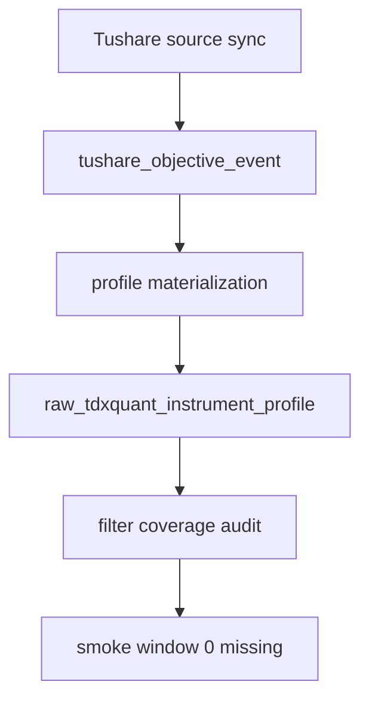

# 71-Tushare objective source runner 与 objective profile materialization 证据
`日期：2026-04-15`
`对应卡片：71-tushare-objective-source-ledger-and-profile-materialization-card-20260415.md`

## 执行命令

```powershell
python -m pytest tests/unit/data/test_tushare_objective_runner.py tests/unit/data/test_tdxquant_runner.py tests/unit/filter/test_objective_coverage_audit.py -q --basetemp H:\Lifespan-temp\pytest-tmp\codex-tushare-objective
python scripts/system/check_development_governance.py
python scripts/system/check_doc_first_gating_governance.py

python scripts/data/run_tushare_objective_source_sync.py --raw-db-path H:\Lifespan-data\raw\raw_market.duckdb --signal-start-date 2026-04-01 --signal-end-date 2026-04-08 --instrument 000001.SZ --instrument 000002.SZ --run-id smoke-tushare-source-20260415a --summary-path H:\Lifespan-report\data\smoke-tushare-source-20260415a.json --tushare-token <redacted>
python scripts/data/run_tushare_objective_profile_materialization.py --raw-db-path H:\Lifespan-data\raw\raw_market.duckdb --signal-start-date 2026-04-01 --signal-end-date 2026-04-08 --instrument 000001.SZ --instrument 000002.SZ --run-id smoke-tushare-profile-20260415a --summary-path H:\Lifespan-report\data\smoke-tushare-profile-20260415a.json
python scripts/filter/run_filter_objective_coverage_audit.py --signal-start-date 2026-04-01 --signal-end-date 2026-04-08 --group-limit 20 --summary-path H:\Lifespan-report\filter\smoke-filter-objective-coverage-audit-20260415a.json --report-path H:\Lifespan-report\filter\smoke-filter-objective-coverage-audit-20260415a.md
```

## 关键结果

- 正式实现已落地：
  - `src/mlq/data/tushare.py`
  - `src/mlq/data/data_tushare_objective.py`
  - `src/mlq/data/data_tushare_objective_support.py`
  - `src/mlq/data/bootstrap_objective_tables.py`
  - `scripts/data/run_tushare_objective_source_sync.py`
  - `scripts/data/run_tushare_objective_profile_materialization.py`
  - `tests/unit/data/test_tushare_objective_runner.py`
- `bootstrap.py` 已把 objective 相关 DDL/约束拆到 helper 模块，文件长度从 `1109` 行降到 `818` 行，恢复通过 `1000` 行硬上限治理。
- 单测与相关回归通过：`6 passed in 7.05s`。
- `check_development_governance.py` 通过；`check_doc_first_gating_governance.py` 通过。

## 真实 bounded smoke

### 1. source sync

- 真实库路径：
  - `H:\Lifespan-data\raw\raw_market.duckdb`
- bounded window：
  - `2026-04-01 -> 2026-04-08`
- smoke scope：
  - `000001.SZ`
  - `000002.SZ`
- 真实 run summary：
  - `run_id = smoke-tushare-source-20260415a`
  - `candidate_cursor_count = 21`
  - `processed_request_count = 21`
  - `successful_request_count = 21`
  - `failed_request_count = 0`
  - `inserted_event_count = 2`

source ledger 真实落表摘要：

```text
('000001.SZ', 'stock_basic', 'instrument_metadata', 1991-04-03, 'listed')
('000002.SZ', 'stock_basic', 'instrument_metadata', 1991-01-29, 'listed')
```

### 2. profile materialization

- 真实 run summary：
  - `run_id = smoke-tushare-profile-20260415a`
  - `candidate_profile_count = 10`
  - `processed_profile_count = 10`
  - `inserted_profile_count = 10`
  - `reused_profile_count = 0`
  - `rematerialized_profile_count = 0`

profile 落表摘要：

```text
('000001.SZ', 2026-04-01, '平安银行', 'sz', 'stock', 'listed', 'tushare')
('000001.SZ', 2026-04-02, '平安银行', 'sz', 'stock', 'listed', 'tushare')
('000001.SZ', 2026-04-03, '平安银行', 'sz', 'stock', 'listed', 'tushare')
('000001.SZ', 2026-04-07, '平安银行', 'sz', 'stock', 'listed', 'tushare')
('000001.SZ', 2026-04-08, '平安银行', 'sz', 'stock', 'listed', 'tushare')
('000002.SZ', 2026-04-01, '万科Ａ', 'sz', 'stock', 'listed', 'tushare')
('000002.SZ', 2026-04-02, '万科Ａ', 'sz', 'stock', 'listed', 'tushare')
('000002.SZ', 2026-04-03, '万科Ａ', 'sz', 'stock', 'listed', 'tushare')
('000002.SZ', 2026-04-07, '万科Ａ', 'sz', 'stock', 'listed', 'tushare')
('000002.SZ', 2026-04-08, '万科Ａ', 'sz', 'stock', 'listed', 'tushare')
```

### 3. coverage audit

- `filter_snapshot_count = 2`
- `objective_profile_row_count = 10`
- `objective_profile_instrument_count = 2`
- `covered_objective_count = 2`
- `missing_objective_count = 0`
- `missing_ratio = 0.0`

这说明在 `2026-04-01 -> 2026-04-08`、`000001.SZ / 000002.SZ` 这个真实 bounded smoke 窗口内，`69` 暴露的 objective missing 已从 `100% missing` 降到 `0 missing`。

## smoke 中发现的问题与修复

- 首次真实 source sync 暴露了一个实现偏差：
  - `suspend_d / stock_st` 归一化路径没有按 `instrument_list` 过滤。
  - 这导致第一次 smoke run `smoke-tushare-source-20260415a` 错写了 scope 外标的，出现 `inserted_event_count = 975`、覆盖 `201` 个标的的异常结果。
- 修复动作：
  - 在 `src/mlq/data/data_tushare_objective.py` 中为 `suspend_d / stock_st` 增加 `scope_codes` 过滤。
  - 在 `tests/unit/data/test_tushare_objective_runner.py` 中补了“窗口内存在非目标标的返回”场景。
  - 清理了该次错误 smoke run 对 `tushare_objective_{run,request,checkpoint,event}` 的落表影响，仅按 `run_id = smoke-tushare-source-20260415a` 定向删除，不触碰其他历史账本。
  - 之后重跑 source sync，结果恢复到 `2` 条 event 的预期口径。

## 产物

- `H:\Lifespan-report\data\smoke-tushare-source-20260415a.json`
- `H:\Lifespan-report\data\smoke-tushare-profile-20260415a.json`
- `H:\Lifespan-report\filter\smoke-filter-objective-coverage-audit-20260415a.json`
- `H:\Lifespan-report\filter\smoke-filter-objective-coverage-audit-20260415a.md`

## 证据结构图

