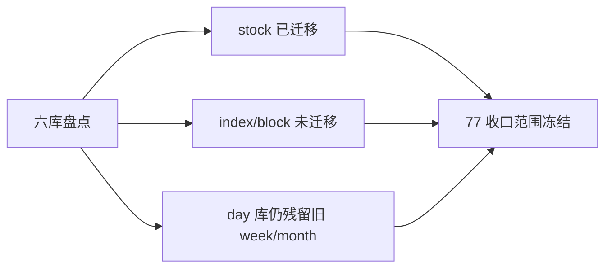

# raw/base 日周月分库迁移尾收口 证据

证据编号：`77`
日期：`2026-04-18`

## 命令

```text
duckdb 查询 H:\Lifespan-data\raw\raw_market.duckdb / raw_market_week.duckdb / raw_market_month.duckdb
duckdb 查询 H:\Lifespan-data\base\market_base.duckdb / market_base_week.duckdb / market_base_month.duckdb
盘点 stock/index/block × day/week/month × raw/base 的 row_count / code_count / date_range
盘点 day 库中遗留 week/month 表族数量与旧数据残留范围
```

## 关键结果

- `raw_market.duckdb / market_base.duckdb` 中的 `day` 数据已完整存在，且 `stock/index/block day backward` 的 code/row/date_range 已核实
- 新 `week/month` 官方库目前只迁完了 `stock`
- `index/block week/month` 仍在旧 `day` 库
- 旧 `day` 库中仍保留 `6` 张 `week/month` 价格表，说明六库迁移未完全收口

## 产物

- 当前卡片：
  [77-raw-base-timeframe-split-tail-completion-card-20260418.md](/H:/lifespan-0.01/docs/03-execution/77-raw-base-timeframe-split-tail-completion-card-20260418.md)
- 当前结论：
  [77-raw-base-timeframe-split-tail-completion-conclusion-20260418.md](/H:/lifespan-0.01/docs/03-execution/77-raw-base-timeframe-split-tail-completion-conclusion-20260418.md)

## 证据结构图


