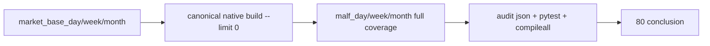

# malf timeframe native base source 重绑 证据

`证据编号`：`80`
`日期`：`2026-04-18`

## 命令

```text
python scripts/system/check_doc_first_gating_governance.py
python -m pytest tests/unit/malf/test_canonical_runner.py tests/unit/malf/test_bootstrap_path_contract.py tests/unit/malf/test_malf_runner.py tests/unit/malf/test_mechanism_runner.py tests/unit/malf/test_wave_life_runner.py tests/unit/malf/test_wave_life_explicit_queue_mode.py -q
python -m pytest tests/unit/structure/test_runner.py tests/unit/filter/test_runner.py tests/unit/alpha/test_pas_runner.py -q
python -m compileall src\mlq\malf\canonical_runner.py src\mlq\malf\canonical_shared.py src\mlq\malf\canonical_source.py tests\unit\malf\test_canonical_runner.py
python scripts/malf/run_malf_canonical_build.py --limit 0 --run-id malf-canonical-full-20260418 --summary-path H:\Lifespan-report\malf\malf-canonical-full-20260418-summary.json
python - (DuckDB 审计脚本，输出 H:\Lifespan-report\malf\80-malf-timeframe-native-full-coverage-audit-20260418.json)
```

## 关键结果

- doc-first gating 通过，当前待施工卡 `80-malf-timeframe-native-base-source-rebind-card-20260418.md` 已具备正式前置文档。
- `canonical_runner` 已改成 timeframe native source：`D -> market_base_day.stock_daily_adjusted`、`W -> market_base_week.stock_weekly_adjusted`、`M -> market_base_month.stock_monthly_adjusted`，不再默认从 day 内部重采样周月。
- `limit=0` 已恢复为 canonical full coverage 入口；专项 `malf` 回归 `14 passed`，代表性 downstream 回归 `20 passed`。
- 官方 full coverage 已落盘：
  - `market_base_day/week/month` backward source 都覆盖 `5501` 个 scope，日期范围分别为 `1990-12-19/21/31 -> 2026-04-10`
  - `malf_day / malf_week / malf_month` 最新 run 均为 `malf-canonical-full-20260418` 且 `run_status='completed'`
  - 三库 `checkpoint_count=5501`、`queue_status='completed'=5501`、`checkpoint end=2026-04-10`
- 官方三库合同均为 `malf_ledger_contract(storage_mode='official_native', native_timeframe in {'D','W','M'})`，`malf_state_snapshot` 的 `timeframe` 也分别只剩单值 `D / W / M`。

## 产物

- `src/mlq/malf/canonical_runner.py`
- `src/mlq/malf/canonical_source.py`
- `src/mlq/malf/canonical_shared.py`
- `tests/unit/malf/test_canonical_runner.py`
- `H:\Lifespan-data\malf\malf_day.duckdb`
- `H:\Lifespan-data\malf\malf_week.duckdb`
- `H:\Lifespan-data\malf\malf_month.duckdb`
- `H:\Lifespan-report\malf\80-malf-timeframe-native-full-coverage-audit-20260418.json`

## 证据结构图


