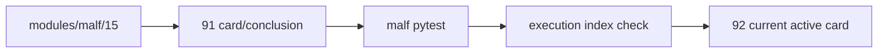

# malf 权威设计锚点补齐与 timeframe native base source 重绑收口 证据

`证据编号`：`91`
`日期`：`2026-04-19`

## 命令

```text
python scripts/system/check_doc_first_gating_governance.py
python -m pytest tests/unit/malf/test_canonical_runner.py tests/unit/malf/test_bootstrap_path_contract.py tests/unit/malf/test_malf_runner.py tests/unit/malf/test_mechanism_runner.py tests/unit/malf/test_wave_life_runner.py tests/unit/malf/test_wave_life_explicit_queue_mode.py -q
python -m pytest tests/unit/malf/test_zero_one_wave_audit.py -q
python .codex/skills/lifespan-execution-discipline/scripts/check_execution_indexes.py --include-untracked
```

## 关键结果

- `doc-first gating` 通过；当前待施工卡仍为 `92-structure-thin-projection-and-day-binding-card-20260418.md`。
- `modules/malf/15` 设计与规格已新增，并明确写死：
  - canonical truth = `malf_day / malf_week / malf_month`
  - readonly sidecar = `mechanism / wave_life / zero_one_audit`
  - bridge v1 只保留兼容角色
  - `0/1` 问题必须经 `run_malf_zero_one_wave_audit.py` 做变更前/后对照
- `malf` 相关单测通过；新增的 `0/1 audit` 单测也通过。
- 执行索引检查通过；说明新增权威设计/规格文档、`91` 卡束与当前 execution 索引保持一致。
- 现行 full coverage 事实保持不变：
  - `malf_day / malf_week / malf_month` 都已完成 official native full coverage
  - 三库最新 checkpoint 均追平到 `2026-04-10`
  - `5501` 个官方 scope 已覆盖

## 产物

- `docs/01-design/modules/malf/15-malf-authoritative-timeframe-native-ledger-charter-20260419.md`
- `docs/02-spec/modules/malf/15-malf-authoritative-timeframe-native-ledger-spec-20260419.md`
- `docs/03-execution/91-malf-timeframe-native-base-source-rebind-card-20260418.md`
- `docs/03-execution/91-malf-timeframe-native-base-source-rebind-conclusion-20260418.md`
- `docs/03-execution/evidence/91-malf-timeframe-native-base-source-rebind-evidence-20260418.md`
- `docs/03-execution/records/91-malf-timeframe-native-base-source-rebind-record-20260418.md`

## 证据结构图


