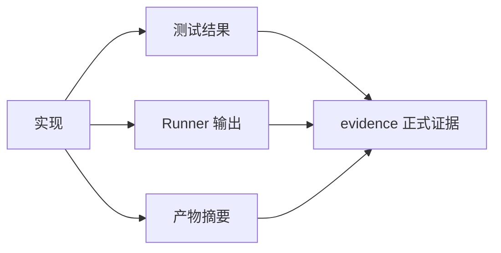

# 证据层

本目录用于保存正式执行工作的可复现证据。

典型内容包括：

- 测试结果
- Runner 输出
- 产物摘要
- 验证摘录

## 流程图

```mermaid
flowchart LR
    IMPL[实现] --> TEST[测试结果]
    IMPL --> RUN[Runner 输出]
    IMPL --> SUM[产物摘要]
    TEST --> EV[evidence 正式证据]
    RUN --> EV
    SUM --> EV
```

