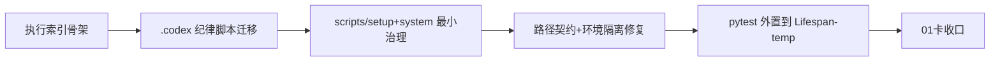

# 治理工具与环境重建记录

记录编号：`01`
日期：`2026-04-09`

## 对应卡片

- `docs/03-execution/01-governance-tooling-and-environment-bootstrap-card-20260409.md`

## 对应证据

- `docs/03-execution/evidence/01-governance-tooling-and-environment-bootstrap-evidence-20260409.md`

## 实施摘要

1. 补齐执行索引账本骨架。
2. 迁移 `.codex` 执行纪律技能与索引脚本。
3. 迁移 `scripts/setup` 与 `scripts/system` 最小治理脚本。
4. 修复 `default_settings(repo_root=...)` 在环境变量已存在时被外层 shell 污染的问题。
5. 为路径契约测试补上环境变量隔离，避免环境重建脚本反向污染单元测试。
6. 将 `pytest` 临时产物与缓存外置到 `H:\Lifespan-temp`。
7. 新增入口文件新鲜度治理，要求治理入口改动时同步刷新 `AGENTS.md`、`README.md`、`pyproject.toml`。
8. 完成环境重建、治理检查与单元测试收口。

## 偏离项与风险

- 本轮只迁移最小治理闭环，没有迁入旧仓业务 runner。
- 后续如果继续扩展治理脚本，仍需要按新仓索引文件名和文档口径逐项适配。

## 流程图

