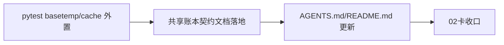

# 历史账本共享契约与pytest路径修正 记录

记录编号：`02`
日期：`2026-04-09`

## 对应卡片

- `docs/03-execution/02-shared-ledger-contract-and-pytest-path-fix-card-20260409.md`

## 对应证据

- `docs/03-execution/evidence/02-shared-ledger-contract-and-pytest-path-fix-evidence-20260409.md`

## 实施摘要

1. 把 `pytest` 的 `basetemp` 和 `cache_dir` 改成固定的 `H:\Lifespan-temp` 绝对路径。
2. 更新入口文件，使共享账本契约和正式环境路径优先级进入 `AGENTS.md`、`README.md`、`docs/README.md`。
3. 新增“历史账本共享契约”设计文档和规格文档。
4. 补充第二张执行卡的阅读顺序、主线账本和任务边界。
5. 验证 `pytest` 从仓库根目录和 `tests/` 子目录运行都不再因相对路径漂移。

## 偏离项与风险

- 连续复用同一个固定 `basetemp` 时，Windows 上偶发会出现目录回收抖动；本轮验证采用先清理再运行的方式隔离平台噪音。
- `doc-first gating` 检查器尚未实现，仍是下一刀。

## 流程图

