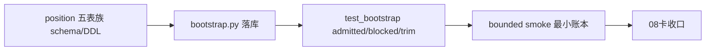

# position 账本表族落库与 bootstrap 记录

记录编号：`08`
日期：`2026-04-09`

## 对应卡片

- `docs/03-execution/08-position-ledger-table-family-bootstrap-card-20260409.md`

## 对应证据

- `docs/03-execution/evidence/08-position-ledger-table-family-bootstrap-evidence-20260409.md`

## 实施摘要

1. 先在 07 已冻结的 design/spec 基础上补了一页 `alpha -> position` 最小 formal signal 桥接合同，明确当前只允许消费最小字段组，不允许偷读 `alpha` 内部过程。
2. 在 `src/mlq/position/bootstrap.py` 中落下 `position` 最小 bootstrap，创建 9 张正式表并幂等写入 4 组默认 policy seed。
3. 新增 `materialize_position_from_formal_signals(...)`，把 `alpha formal signal` 样本最小落成：
   - `position_candidate_audit`
   - `position_capacity_snapshot`
   - `position_sizing_snapshot`
   - 对应 policy family snapshot
4. 补了 `tests/unit/position/test_bootstrap.py`，把 admitted / blocked / trim 三类路径都压成单测。
5. 做了 bounded smoke，确认临时仓里真的能落出 `position_run / candidate / capacity / sizing / fixed_notional` 最小账本。
6. 补齐 08 的 evidence / record / conclusion，并把下一锤切到 09。

## 偏离项与风险

- 当前消费入口还是 in-process helper，不是正式 runner，也还没有从官方 `alpha` 账本直接读表。
- `remaining_portfolio_capacity_weight` 当前在 smoke 和单测里仍允许默认值路径；真正的组合剩余空间读模型仍待后续卡继续冻结。
- family snapshot 当前是最小版落表，距离“完整方法学参数与真实 runner”还有一层实现距离。
- `src/mlq/position/bootstrap.py` 当前达到 `934` 行，虽未触发硬门禁，但已经越过 `800` 行软目标；后续适合拆出 runner/materialization 子模块减轻维护压力。

## 流程图

