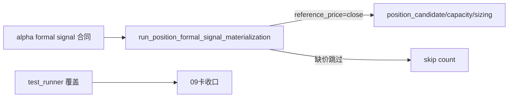

# position formal signal runner 与 bounded validation 记录

记录编号：`09`
日期：`2026-04-09`

## 对应卡片

- `docs/03-execution/09-position-formal-signal-runner-and-bounded-validation-card-20260409.md`

## 对应证据

- `docs/03-execution/evidence/09-position-formal-signal-runner-and-bounded-validation-evidence-20260409.md`

## 实施摘要

1. 新增 `docs/02-spec/modules/position/03-position-formal-signal-runner-spec-20260409.md`，把 09 的 runner 输入、参考价 enrichment、缺价处理和正式输出先冻结。
2. 新增 `src/mlq/position/runner.py`，提供：
   - `run_position_formal_signal_materialization(...)`
   - `PositionFormalSignalRunnerSummary`
   - 官方 `alpha formal signal` bounded 读取
   - `market_base.stock_daily_adjusted` 参考价 enrichment
3. runner 当前默认读取：
   - `alpha.duckdb.alpha_formal_signal_event`
   - `market_base.duckdb.stock_daily_adjusted`
   - `adjust_method = backward`
4. reference price 规则当前冻结为：
   - 默认取 `trade_date > signal_date` 的第一个交易日
   - `reference_price = close`
   - 缺价信号不伪造参考价，直接跳过并计数
5. 为兼容旧官方表口径，runner 支持把旧列名映射到桥接合同最小字段组。
6. 新增 `scripts/position/run_position_formal_signal_materialization.py` 作为正式脚本入口，并同步刷新 `AGENTS.md`、`README.md`、`pyproject.toml`、`scripts/README.md`。
7. 新增 `tests/unit/position/test_runner.py`，覆盖：
   - 官方新口径读取 + 参考价 enrichment
   - 缺价跳过
   - 旧列名兼容映射

## 偏离项与风险

- 09 当前只完成了 `position` 侧的正式消费 runner，并没有把 `alpha` 自己的正式表族与正式 producer 一并落下。
- 因此本轮不能宣称 `alpha` 模块已经正式完工；更准确的说法是：`position` 已具备消费官方 `alpha formal signal` 合同的 runner，等待上游在新仓正式落库。
- 本机 `pytest` 对临时目录存在 Windows 权限问题，runner 断言改以 smoke 留证；单测文件已经补齐，但需要后续在稳定临时目录环境下再跑完整 `pytest` 会话。
- `src/mlq/position/bootstrap.py` 仍然超过 `800` 行软上限；本轮新增逻辑已独立放进 `runner.py`，但 bootstrap 本体尚未回拆。

## 流程图

