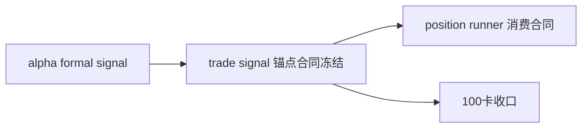

# trade signal anchor contract freeze 记录

记录编号：`100`
日期：`2026-04-11`

## 做了什么

1. 步骤 1
2. 步骤 2

## 偏离项

- 无，或说明偏离原因

## 备注

- 备注 1
- 备注 2

## 流程图

```mermaid
flowchart LR
    ALPHA[alpha formal signal] --> ANC[trade signal 锚点合同冻结]
    ANC --> POSIT[position runner 消费合同]
    ANC --> OK[100卡收口]
```
