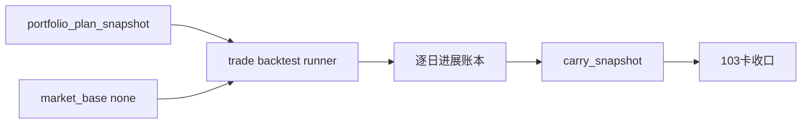

# trade backtest progression runner 记录

记录编号：`103`
日期：`2026-04-11`

## 做了什么

1. 步骤 1
2. 步骤 2

## 偏离项

- 无，或说明偏离原因

## 备注

- 备注 1
- 备注 2

## 流程图

```mermaid
flowchart LR
    PP[portfolio_plan_snapshot] --> BT[trade backtest runner]
    MB[market_base none] --> BT
    BT --> PROG[逐日进展账本]
    PROG --> CARRY[carry_snapshot]
    CARRY --> OK[103卡收口]
```
