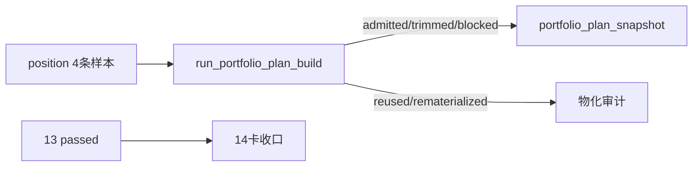

# portfolio_plan 最小账本与 position 桥接记录

记录编号：`14`
日期：`2026-04-09`

## 做了什么？
1. 在 `src/mlq/portfolio_plan/bootstrap.py` 中冻结 `portfolio_plan_run / portfolio_plan_snapshot / portfolio_plan_run_snapshot` 三表 DDL，并补齐 `connect_portfolio_plan_ledger(...)`、`bootstrap_portfolio_plan_ledger(...)` 与正式库路径入口。
2. 新增 `src/mlq/portfolio_plan/runner.py`，实现 `run_portfolio_plan_build(...)`，只从官方 `position_candidate_audit + position_capacity_snapshot + position_sizing_snapshot` 读取最小桥接字段，不回读 `alpha` 内部过程。
3. 在 runner 内固化 `admitted / blocked / trimmed` 裁决规则，并把 `inserted / reused / rematerialized` 三种物化动作写入 `portfolio_plan_run_snapshot`。
4. 新增 `scripts/portfolio_plan/run_portfolio_plan_build.py`，并在 `src/mlq/portfolio_plan/__init__.py` 暴露正式入口。
5. 新增 `tests/unit/portfolio_plan/test_bootstrap.py` 与 `tests/unit/portfolio_plan/test_runner.py`，覆盖：
   - 三表 bootstrap
   - `position -> portfolio_plan` 最小桥接
   - `admitted / trimmed / blocked`
   - `reused / rematerialized`
   - reference trade date bounded window
6. 发现裸 `python` 一度优先命中外部旧仓 `mlq`；在你移动旧仓后，再通过 `python -m pip install -e .` 把当前仓注册为 editable，恢复裸解释器的稳定入口。
7. 由于本轮开始时 `H:\Lifespan-data\position\position.duckdb` 尚不存在，本轮先使用官方 `materialize_position_from_formal_signals(...)` 在正式位置账本中落下 4 条 bounded `position` 样本，再用官方 `portfolio_plan` 脚本完成真实 pilot、unchanged rerun 与受控变更 rerun。

## 偏离项
- 本轮 official pilot 不是直接消费既有的正式 `position` 历史库，而是先由官方 `position` 入口在 `H:\Lifespan-data` 内建立一组最小样本；这属于 14 号卡允许的“先把官方桥接跑通”的最小裁剪，不是绕过 `position`。
- 当前 `portfolio_plan` 只冻结最小三表与最小组合裁决，不宣称已具备完整组合回测、账户簇治理或 `trade/system` 下游消费能力。
- 本轮没有为 `portfolio_plan` 补做独立的 compileall 验证；单测、正式脚本实跑和官方库 readout 已覆盖主要可执行入口。

## 备注

- 当前裸 `python` 已通过 editable 安装稳定命中本仓 `H:\lifespan-0.01\src\mlq`，不再需要依赖临时 `PYTHONPATH=src`。
- DuckDB 文件锁约束依旧成立；正式 `position` 与 `portfolio_plan` 共享库的 read/write readout 需要串行推进，不宜并行压测。
- 14 号卡的实现事实已经落入正式库，但在进入下一张主线卡前，仍应先回到 `Ω-system-delivery-roadmap-20260409.md` 重新规划 `trade / system` 的下一锤。

## 流程图

