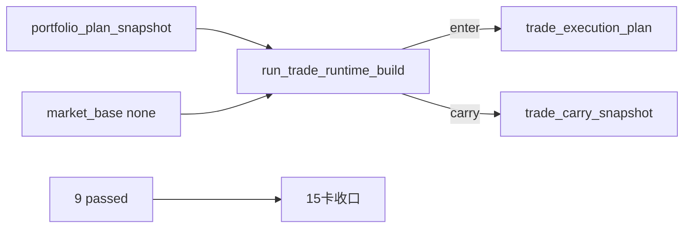

# trade 最小 runtime 账本与 portfolio_plan 桥接记录

日期：`2026-04-10`
对应卡片：`15-trade-minimal-runtime-ledger-and-portfolio-plan-bridge-card-20260409.md`
状态：`已收口`

## 本轮实施

1. 新增 `src/mlq/trade/bootstrap.py`
   - 冻结 `trade_run / trade_execution_plan / trade_position_leg / trade_carry_snapshot / trade_run_execution_plan` 五表 DDL。
2. 新增 `src/mlq/trade/runner.py`
   - 正式入口：`run_trade_runtime_build(...)`
   - 只消费官方 `portfolio_plan_snapshot`、官方 `market_base.stock_daily_adjusted` 与上一轮 `trade_carry_snapshot`
   - 物化 `planned_entry / blocked_upstream / planned_carry`
   - 维护 `inserted / reused / rematerialized` 审计。
3. 新增 `scripts/trade/run_trade_runtime_build.py`
   - 正式脚本入口。
4. 新增 `tests/unit/trade/test_bootstrap.py` 与 `tests/unit/trade/test_runner.py`
   - 覆盖五表 bootstrap、bounded bridge、carry-forward、rerun reused、受控 rematerialized。
5. 更新入口文件
   - `README.md`
   - `pyproject.toml`
   - `scripts/README.md`

## 关键实现选择

1. `trade_execution_plan`
   - `portfolio_plan` 行映射规则：
     - `plan_status in ('admitted', 'trimmed') and admitted_weight > 0` -> `enter / planned_entry`
     - `plan_status='blocked'` 或 `admitted_weight <= 0` -> `block_upstream / blocked_upstream`
   - `planned_entry_trade_date` 固定从 `market_base.stock_daily_adjusted` 查 `reference_trade_date` 之后的下一交易日。
2. `planned_carry`
   - 为了让 carry 成为显式执行事实，runner 会把上一轮 retained carry 生成成新的 `carry_forward / planned_carry` 执行计划。
   - carry-only 行采用合成的 `plan_snapshot_nk = carry::{carry_snapshot_nk}`，避免把 `portfolio_plan` 主语误写回上游。
3. rerun 输入边界
   - 当前窗口 rerun 只读取 `snapshot_date < signal_start_date` 的 prior carry。
   - 这样可以避免“本轮刚写出的 carry 反过来污染同一窗口 rerun”，保证 `main_book` 同窗第二次运行得到 `execution_plan_reused_count=4`。
4. `trade_position_leg`
   - `enter` 会生成新的 `|core` open leg。
   - `carry_forward` 不新造腿，而是复用上一轮 `carry_source_leg_nk` 指向的 open leg，只刷新 `last_materialized_run_id`。
5. `trade_carry_snapshot`
   - 同一窗口 rerun 时，open leg 自身的 `last_materialized_run_id` 会推进，所以 carry snapshot 允许出现 `rematerialized`，这属于 carry 审计元数据显式更新，不是自然键漂移。

## 正式 pilot 过程中新增/变更的正式样本

1. 新建 `H:\Lifespan-data\base\market_base.duckdb`
   - 原因：卡 15 官方 pilot 需要 `market_base`，而当前环境缺失正式基库。
   - 处理方式：补一份只覆盖卡 14/15 bounded pilot 仪器与日期的最小正式样本库。
2. 向 `H:\Lifespan-data\portfolio_plan\portfolio_plan.duckdb` 新增 `trade_pilot_book`
   - 原因：需要证明 `rematerialized`，但不应回写或污染卡 14 既有 `main_book` 官方事实。
   - 处理方式：新增一条独立受控组合行，随后对同一自然键做一次受控权重更新。

## 未在本轮展开的内容

1. 不做 `system` 总装 readout。
2. 不做 broker/session/partial fill。
3. 不做完整 exit/replay 引擎。
4. 不做多账户、多组合簇调度。

## 流程图

