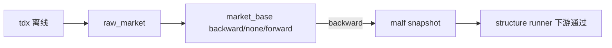

# data/malf 最小官方主线桥接记录

记录编号：`16`
日期：`2026-04-10`

## 做了什么

1. 为 `data` 新增正式 `bootstrap / runner / script`，把 `H:\tdx_offline_Data` 股票日线以历史账本方式写入 `raw_market`，并物化到 `market_base.stock_daily_adjusted`。
2. 为 `market_base` 正式冻结 `adjust_method in {none, backward, forward}` 三套价格。
3. 为 `malf` 新增正式 `bootstrap / runner / script`，从官方 `market_base(backward)` 物化 `pas_context_snapshot / structure_candidate_snapshot`。
4. 用真实正式库验证 `data -> malf -> structure` 已可 bounded 跑通，并留存 `inserted / reused / rematerialized` readout。
5. 把 `position` 与 `trade` 的默认执行参考价从 `backward` 改为 `none`，把“信号口径”和“执行口径”从合同层分开。
6. 回填 `AGENTS.md`、`README.md`、`scripts/README.md`、`pyproject.toml`、路线图与执行索引，纠正“前半段已通”的错误口径。

## 偏离项

1. 本轮开始前曾误把主线重点放到 `trade / system`，后已回切到真正缺口 `data -> malf`。
2. 一次长命令超时后残留 DuckDB 占锁进程，已手动清理并改回顺序执行。
3. `tests/unit/data/test_runner.py` 与 `tests/unit/malf/test_runner.py` 与既有测试文件重名，导致 pytest import collision；本轮已改名为 `test_data_runner.py` 与 `test_malf_runner.py`。

## 备注

1. `forward` 当前只作为研究与展示保留，不作为正式执行口径。
2. `malf -> structure -> filter -> alpha` 默认使用 `backward`。
3. `position -> trade` 默认使用 `none`。
4. 本轮只宣称 `data -> malf -> structure` 最小官方桥接成立，不宣称 `system` 已成立。

## 流程图

