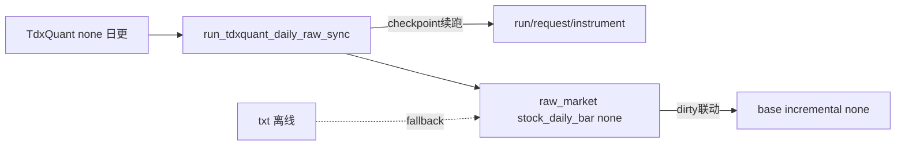

# TdxQuant 日更原始事实接入 raw/base 账本桥接 记录

记录编号：`19`
日期：`2026-04-10`

## 做了什么

1. 已为卡 `19` 生成 execution 四件套。
2. 已根据卡 `18` 的阶段性结论，新增 `data/04` 号 design/spec：
   - 把 `TdxQuant` 的角色冻结为“日更原始事实源头”
   - 把 `TdxQuant(front/back)` 禁止直接写成正式复权真值
   - 把实现边界收敛到 `raw` 侧桥接、run/request/checkpoint 审计与 dirty queue 联动
3. 已把卡 `19` 的任务分解写成正式实现卡：
   - 先建合同
   - 再建 raw 侧 runner
   - 再做 bounded official pilot
4. 已手动补齐执行索引，并把当前待施工卡切换到 `19`。
5. 已进入卡 `19` 切片 2 的正式代码实现：
   - 在 `raw_market` 补齐 `raw_tdxquant_run / raw_tdxquant_request / raw_tdxquant_instrument_checkpoint`
   - 新增 `run_tdxquant_daily_raw_sync(...)` 与 CLI 入口
   - 新增 `src/mlq/data/tdxquant.py`，把外部 `tqcenter` 依赖收敛成可注入客户端契约
   - 复用既有 `stock_daily_bar` 真值面，只桥接 `adjust_method='none'`
   - 与 `base_dirty_instrument(adjust_method='none')` 建立最小联动
6. 已补卡 `19` 的最小单测闭环：
   - registry + onboarding 并集 scope
   - request/checkpoint skipped_unchanged
   - failed request / failed run 审计
   - 现有 data 单测总计 `8 passed`
7. 已同步刷新仓库入口文件：
   - `AGENTS.md`
   - `README.md`
   - `pyproject.toml`
8. 已补真实 official pilot：
   - 在本机正在运行的 `G:\new_tdx64\TdxW.exe` 环境下，使用唯一 strategy path 连续执行 `tq-official-card19-001 / 002`
   - onboarding 标的范围固定为 `000001.SZ / 920021.BJ / 510300.SH`
   - 首轮 run 已真实写入/重物化 `raw_market.stock_daily_bar(adjust_method='none')`
   - 第二轮 replay 已真实命中 `request/checkpoint skipped_unchanged`
9. 已补 `raw -> base` 联动验证：
   - `base-card19-none-001` 真实消费了 3 个 `none` dirty 标的
   - 同时发现旧版 `dirty_queue` stage 仍受全局 `limit=1000` 截断
   - 已把该行为修正为“dirty_queue 不再受全局 row limit 截断”，并新增回归单测

## 偏离项

- `new_execution_bundle.py` 在自动回填索引时，仍因旧目录标题不是“当前正式结论”而中断。
- 四件套文件本体已正常生成；索引与 current card 指针改由手动回填。
- 卡 `19` 虽已补真实 bounded official pilot，但结论文件当前尚未改写为“生效”。
- 本轮修复了一个执行侧边界问题：
  - `run_market_base_build(adjust_method='none', build_mode='incremental')` 在 dirty queue 下若沿用默认 `limit=1000`，会截断脏标的完整历史窗口。
  - 该问题已在代码与单测层修复，但还没有单独开新卡；当前先按卡 `19` 的联动边界处理。

## 备注

- 当前最新已生效结论锚点仍是 `17`，卡 `18` 仍是“方案选型”结论来源。
- 卡 `19` 已进入正式代码实现，但当前阶段仍属于“切片 2 已落地、official pilot 未完成”状态。
- 当前卡 `19` 的默认方向已经冻结为：
  - `TdxQuant(dividend_type='none')` 更适合作为官方日更原始事实入口
  - 复权继续留在仓内可审计物化层
  - `txt` 路线继续保留为正式 fallback

## 流程图

