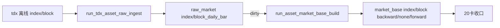

# 指数与板块 raw/base 增量桥接记录

记录编号：`20`
日期：`2026-04-10`

## 做了什么

1. 开卡 `20`，补齐 `index/block` 的 design / spec / card / conclusion / evidence / record 与执行索引。
2. 在 `src/mlq/data/bootstrap.py` 中补齐 `index/block` 的 `raw_market / market_base` 表族，并把共享审计账本升级为显式 `asset_type`。
3. 在 `src/mlq/data/runner.py` 中新增：
   - `run_tdx_asset_raw_ingest(...)`
   - `run_asset_market_base_build(...)`
   - 与 `asset_type` 对应的 raw/file/dirty/base helper
4. 在 `scripts/data/` 中新增 `run_tdx_asset_raw_ingest.py`，并让 `run_market_base_build.py` 支持 `--asset-type`。
5. 在 `src/mlq/data/__init__.py` 与 `pyproject.toml` 中补齐新入口导出与治理登记。
6. 在 `tests/unit/data/test_data_runner.py` 中补齐 `index/block` 的 raw ingest 与 base build 增量用例。
7. 用真实离线目录完成 `index/block` 三套复权的 full raw 初始化、full base 物化，以及 incremental replay 验证。

## 偏离项

- `README.md` 现有正文存在历史编码污染；本次先保证 `AGENTS.md / pyproject.toml / docs execution bundle / runner / tests` 口径闭环，README 清洗留待后续单独整理。
- 本卡未引入 `index/block` 的 TdxQuant official 桥接，也未引入板块成分关系账本，保持原冻结边界不变。

## 备注

- 卡 `20` 已从施工态切换为正式生效结论锚点。
- 当前 `data` txt 主链已覆盖 `stock + index + block`，并且真实验证了“建仓后 replay 不重写、dirty queue 为空时 base no-op 续跑”的增量语义。

## 流程图

