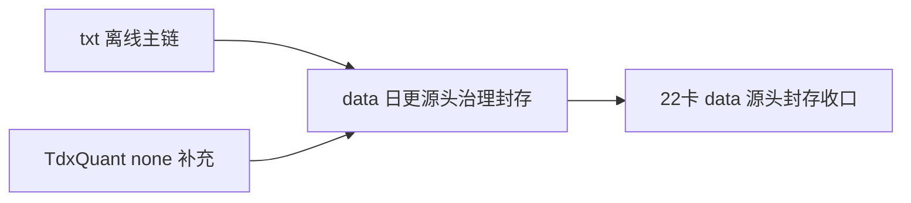

# data 日更源头治理封存 记录

记录编号：`22`
日期：`2026-04-11`

## 做了什么

1. 回读卡 `18/19/20/21` 的 design/spec/conclusion，确认当前正式 `data` 日更治理并非“统一主源”，而是共享同一套历史账本机制下的阶段性双 source adapter 分工。
2. 基于 `2026-04-10` 收盘后真实更新结果，整理出当前 operator 口径：`stock` 走 `TdxQuant(none)` 主路，`index/block` 走 `H:\tdx_offline_Data` txt 主路，txt 同时继续承担 fallback 与审计回放角色。
3. 根据用户最新裁决，新增卡 `22` 四件套，正式封存“当前不再推进 source adapter 统一；未来若要统一，必须另开新卡并补齐 bounded evidence”的治理结论。
4. 通过执行索引回填，把 `22` 设置为最新正式结论锚点与当前待施工卡锚点，确保后续执行先读本卡再判断是否需要新扩展卡。

## 偏离项

- 原计划使用仓库脚本 `new_execution_bundle.py --register --set-current-card` 自动回填索引，但脚本在 `00-conclusion-catalog-20260409.md` 上因为栏目标题不匹配而中途失败。
- 本次未回退已生成的四件套骨架，而是保留生成结果并手工回填内容与索引；这属于执行工具兼容性偏离，不影响本卡治理结论本身。

## 备注

- 本卡是治理封存卡，不新增 `src/`、`scripts/` 或 schema 变更。
- 本卡不是对 “统一到 `TdxQuant(none)` 主路” 的否决，而是把该事项重新降回“未来需单独立项验证”的状态。
- 本卡默认前提是用户会继续每日维护 `H:\tdx_offline_Data`，因此 `index/block` 的 txt 主链在当前阶段仍具备稳定运营条件。

## 流程图

