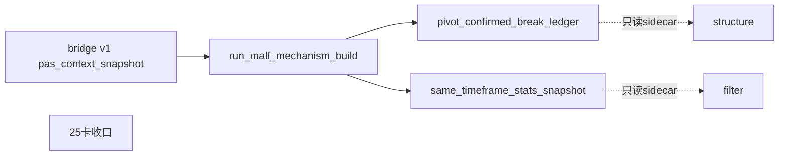

# malf 机制层 sidecar 账本 bootstrap 与下游接入记录

记录编号：`25`
日期：`2026-04-11`

## 做了什么

1. 基于 `25` 号卡与 `05` 号 malf 机制层 design/spec，把实现锚点从文档冻结推进到正式账本与 bounded runner。
2. 在 `src/mlq/malf/bootstrap.py` 中新增机制层 run/checkpoint 与三张 sidecar 表，并补齐列迁移逻辑。
3. 新增 `src/mlq/malf/mechanism_runner.py`，按 bridge v1 输入物化 break ledger、stats profile、stats snapshot，并用 `malf_mechanism_checkpoint` 记录 `instrument + timeframe` 增量边界。
4. 新增 `scripts/malf/run_malf_mechanism_build.py`，把机制层 runner 固化为正式脚本入口。
5. 在 `src/mlq/structure` 中补 schema 迁移钩子和 sidecar 只读接入，把 break/stats sidecar 附加到 `structure_snapshot`，但保持 `structure_progress_state` 仍只由结构输入推导。
6. 在 `src/mlq/filter` 中补 schema 迁移钩子和 sidecar 只读透传，把 break/stats sidecar 写入 `filter_snapshot` 并转成 admission note，不把 sidecar 提升成新的拦截条件。
7. 补 `tests/unit/malf/test_mechanism_runner.py`，并扩展 `structure / filter` 单测，覆盖 checkpoint、sidecar 附着与透传合同。
8. 同步入口文件 `AGENTS.md / README.md / pyproject.toml`，把新的正式 runner 入口与机制层边界写回仓库入口。
9. 回填 `25` 号卡的 evidence/record/conclusion、目录索引与当前结论锚点。

## 偏离项

- 本轮实现的是 bridge-era 机制层 bounded runner，不宣称 pure semantic canonical runner 已经落地。
- `filter` 仍未把 sidecar 升格成新的硬阻断逻辑，只做只读透传与提示；这与 `24` 号卡冻结的角色边界一致。

## 备注

- `run_malf_snapshot_build.py` 仍继续承担 bridge v1 兼容输出职责，`run_malf_mechanism_build.py` 则只消费 bridge v1 输出并沉淀机制层 sidecar 账本。
- scoped `check_development_governance.py` 通过；全仓运行时仍会继续报仓库既有的超长文件和中文化历史债务，这次没有新增同类问题。

## 流程图

