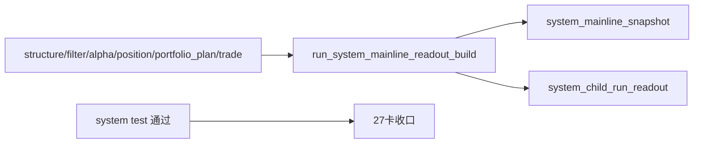

# system 主链 bounded acceptance readout 与 audit bootstrap 记录
记录编号：`27`
日期：`2026-04-11`

## 做了什么
1. 先按仓库纪律回读 `README / docs/README / system charter / doc-first governance / 26 号结论 / 27 号卡 / system 设计与 spec`，确认本轮边界只做 `system` 最小 readout / audit / freeze bootstrap，不碰 live orchestration 与 broker/account lifecycle。
2. 对照 `portfolio_plan` 与 `trade` 的既有实现模式，确定 `system` 也采用 `bootstrap.py + runner.py + CLI + unit test` 的最小正式结构。
3. 在 `src/mlq/system/bootstrap.py` 冻结四张正式表：
   - `system_run`
   - `system_child_run_readout`
   - `system_mainline_snapshot`
   - `system_run_snapshot`
4. 在 `src/mlq/system/runner.py` 实现 bounded readout runner：
   - 自动从官方 `structure / filter / alpha_trigger / alpha_formal_signal / position / portfolio_plan / trade` 账本选取已完成 child run
   - 只从 `trade_execution_plan / trade_position_leg / trade_carry_snapshot` 汇总系统级 `planned_entry / blocked_upstream / planned_carry / open_leg / current carry`
   - 对 child-run readout 与 mainline snapshot 执行 `inserted / reused / rematerialized` 审计
5. 补 `src/mlq/system/__init__.py` 导出和 `scripts/system/run_system_mainline_readout_build.py` CLI 入口，把 runner 固定成正式脚本入口。
6. 新增 `tests/unit/system/test_system_runner.py`，用真实 `structure -> filter -> alpha -> position -> portfolio_plan -> trade -> system` 路径验证：
   - 首次 system 物化
   - 同窗口复跑 `reused`
   - 当 trade run 变更时 system snapshot `rematerialized`
7. 跑通新增 system 单测与原有 `26` 号 truthfulness 回归测试，确认 `system` bootstrap 没有打坏既有主链。
8. 回填 `27` 的 evidence / record / conclusion，并同步更新执行索引，把“当前待施工卡”从 `27` 收口为“待开下一张 system runtime/orchestration 卡”。

## 偏离项

- 本轮没有把 `system` 扩成 live runtime、broker/account lifecycle、filled/pnl/reconciliation 全量运行时；这些仍明确属于 `27` 范围外。
- 当前 `system` 第一阶段没有反向回写上游 `alpha / position / trade` 业务事实，也没有重算它们的业务逻辑，只做官方 readout 与审计冻结。

## 备注

- `position_run` 历史上没有 `summary_json` 字段，只有 `notes` 与 `source_signal_*` 元数据；本轮 `system` readout 对它做了兼容封装，但没有借机改造 `position` 上游账本结构。
- `system_mainline_snapshot` 的自然键固定为 `portfolio_id + snapshot_date + system_scene + system_contract_version`；因此即使系统级读数相同，只要引用的官方 child run 发生变化，也会按正式审计语义记为 `rematerialized`，而不是口头认定“看起来一样”。

## 流程图

