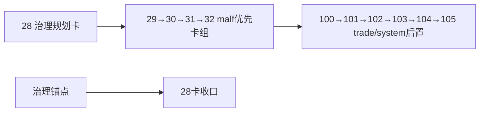

# system-wide checkpoint and dirty queue alignment 记录

记录编号：`28`
日期：`2026-04-11`
状态：`已补记录`

## 做了什么

1. 复核 `28` 的治理要求与 `29-32` 的实际落地状态，确认这张卡承担的是“统一 data-grade checkpoint + dirty queue 基线并冻结后续自然数施工顺序”。
2. 复核 `tests/unit/malf/test_malf_runner.py` 的 bridge v1 兼容测试，确认该测试已经改为显式指定 `source_context_table="pas_context_snapshot"` 与 `source_structure_input_table="structure_candidate_snapshot"`。
3. 回填 `28` 的 evidence / record / conclusion，把“`29-32` 是 malf 优先卡组、`100-105` 是后置 trade/system 卡组”的治理裁决正式落文。

## 偏离项

- `28` 是治理规划卡，不直接新增业务代码实现。
- 实际自然数后续卡组已落为 `29 -> 30 -> 31 -> 32 -> 100 -> 101 -> 102 -> 103 -> 104 -> 105`，不再沿用卡面里旧的 `29-38` 占位表述。

## 备注

- 本次闭环后，`28` 的剩余工作不再是代码施工，而是作为治理锚点继续约束 `100-105` 的后置卡组。

## 流程图

