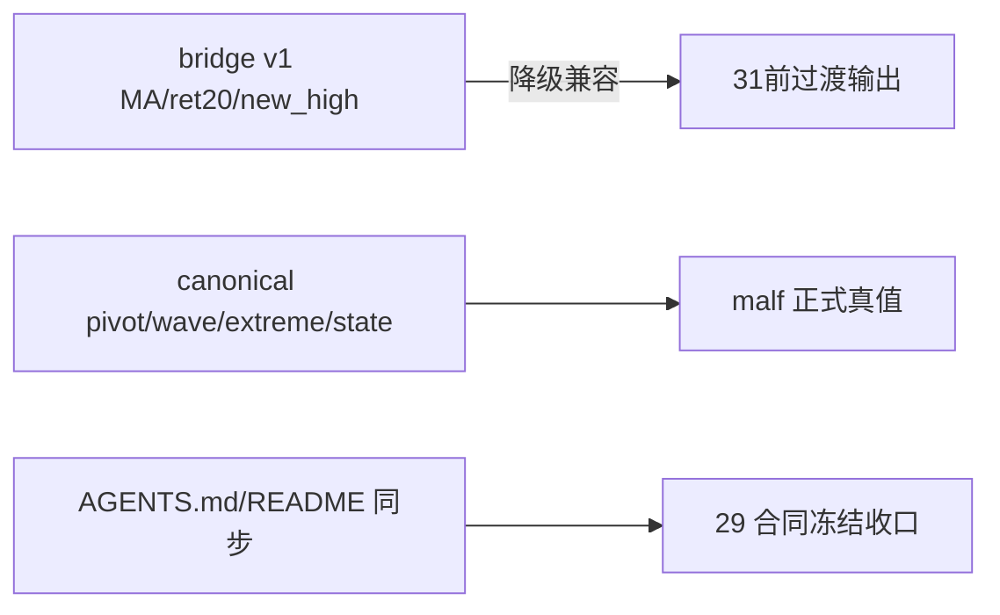

# malf semantic canonical contract freeze 记录

日期：`2026-04-11`
状态：`已补记录`

## 执行摘要

1. 重新收口 `29` 的 charter / spec / card，使 `malf` 正式口径切换为纯语义 canonical v2。
2. 明确 `execution_interface / allowed_actions / confidence / 高周期 context 反馈` 均不属于 `malf core`。
3. 明确 bridge v1 输出继续保留，但只作为 `31` 之前的过渡兼容面。
4. 同步刷新 `AGENTS.md` 与 `README.md`，避免入口文件继续把 bridge v1 当正式真值。

## 决策记录

- `malf` 正式真值不再允许依赖 `MA / ret20 / new_high_count` 近似语义
- `牛逆 / 熊逆` 只允许作为旧顺结构失效到新顺结构确认前的过渡状态
- `pivot-confirmed break` 与 `same-timeframe stats` 明确降为 core 之外的只读机制/统计层

## 流程图

