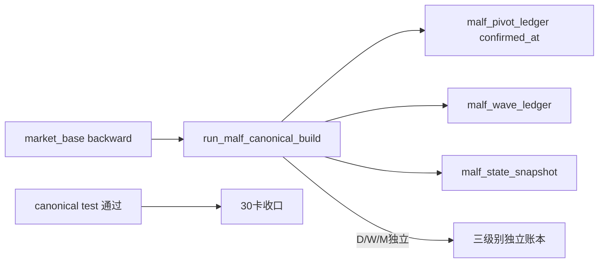

# malf canonical ledger and data-grade runner bootstrap 记录

日期：`2026-04-11`
状态：`已补记录`

## 执行摘要

1. 在 `src/mlq/malf/bootstrap.py` 新增 canonical `malf` 八张正式表。
2. 新增 `src/mlq/malf/canonical_runner.py`，实现：
   - `D / W / M` 聚合与独立结构计算
   - pivot `confirmed_at`
   - wave / extreme / state / same_level_stats 物化
   - `work_queue / checkpoint / run` 最小 data-grade 续跑语义
3. 新增 `scripts/malf/run_malf_canonical_build.py` 作为 bounded runner 入口。
4. 在 `src/mlq/malf/__init__.py` 导出 canonical runner、常量和 summary。
5. 同步刷新 `AGENTS.md`、`README.md`、`pyproject.toml`。
6. 补 `tests/unit/malf/test_canonical_runner.py`，并回归旧 `malf` runner / mechanism tests。

## 关键实现取舍

- canonical runner 当前与 bridge v1 并存，不直接回写旧表
- `same_level_stats` 优先使用 completed wave；当 scope 首轮建仓还没有 completed wave 时，允许用 active wave 启动最小 stats，避免初次建仓空壳
- `checkpoint.tail_start_bar_dt` 当前先落为 scope 首 bar，意味着初版 replay 颗粒度仍是 scope 级全回放；后续若要更细 replay，可继续在 `28` 总治理卡下深化

## 已验证命令

```bash
pytest tests/unit/malf/test_canonical_runner.py -q
pytest tests/unit/malf/test_malf_runner.py tests/unit/malf/test_mechanism_runner.py tests/unit/malf/test_canonical_runner.py -q
```

## 流程图


