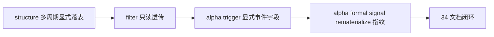

# malf multi-timeframe downstream consumption 记录

记录编号：`34`  
日期：`2026-04-12`  
状态：`已补记录`

## 做了什么

1. 扩展 `structure_snapshot / filter_snapshot / alpha_trigger_event / alpha_formal_signal_event` 的正式列族，显式落表 `daily/weekly/monthly` 多周期上下文与对应 `source_context_nk`。
2. 在 `structure` 中接入 canonical `W/M` 只读读取逻辑，保持 `D` 精确匹配为主，`W/M` 仅按最近可用 `asof_date` 挂接，不反写 `D` 主语义。
3. 在 `filter` 中透传多周期字段，并将 `W/M` 保持为只读 admission note/sidecar 背景，不引入新的准入硬拦截。
4. 在 `alpha trigger / formal signal` 中把多周期字段写入正式事件账本，并将其纳入 rematerialize 指纹。
5. 重写并补齐 `structure / filter / alpha` 三份单测，覆盖多周期透传、monthly 变更触发 rematerialize、alpha 事件显式落列。
6. 修补 bulk edit 遗漏的 helper 与 CTE 投影缺口，随后回填 `34` 的 `evidence / conclusion` 与执行索引。

## 偏离项

- `filter` 的 `admission_notes` 历史占位文案在本卡中顺手规范为中文正式口径；这只影响提示文本，不改变准入逻辑。
- `tests/unit/filter/test_runner.py` 与 `tests/unit/alpha/test_runner.py` 因终端可见编码混乱，采用整文件 UTF-8 重写以避免局部 patch 误伤；测试语义保持在卡 34 范围内。

## 备注

- `alpha_formal_signal_event` 仍保留 `malf_context_4 / lifecycle_rank_*` 兼容字段，仅供当前 `position` 过渡消费，不代表卡 34 新增正式真值。
- `35` 将继续处理 downstream data-grade checkpoint / dirty queue 对齐；本卡不越界触碰 queue/checkpoint 语义。

## 记录结构图

